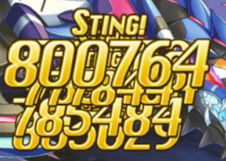

全神姬简评（截止至2022年11月）By：Reynol

红字为重点。蓝字为后续更新评价。

火系

{width="0.7811023622047244in"
height="0.7811023622047244in"}

阿瑞斯：炮击+自嗨打手，火炮击可选组件，需要觉醒。输出不错，但是不推荐交3眼觉醒。

{width="0.7811023622047244in"
height="0.7811023622047244in"}

天照：时代的眼泪。20B类破甲的缓回姬，近期觉醒无望属于是仓管。

{width="0.7811023622047244in"
height="0.7811023622047244in"}

不动明王：对怒特化，需要觉醒。上修给了一次无条件对怒特攻（歪愤），然而倍率太低CD太长，基本仓管。

{width="0.7811023622047244in"
height="0.7811023622047244in"}

马尾：炮击+群体充气，需要觉醒。群充需要暖机，而且火炮击目前不强，出场率不高。

{width="0.7811023622047244in"
height="0.7811023622047244in"}

火索尔，火索：泳装限定角色。20C破+净化奶，新号基本没这个姬，强度还行属于能用。

{width="0.7811023622047244in"
height="0.7811023622047244in"}

阎魔：破甲+异常盾，需要觉醒。招牌是必中的20B破，对抗风90有奇效，觉醒了能用，但是不推荐。

{width="0.7811023622047244in"
height="0.7811023622047244in"}

乌列尔，小天使：核爆火组件，需要觉醒。自身倍率非常高，但是没法突破上限，时代的眼泪之一，基本仓管。

{width="0.7559055118110236in"
height="0.7677165354330708in"}

妲己觉醒：火队万金油。对于以平A为主的火队，狐狸的地位相当于暗积木之于暗队。觉醒狐狸能提供全队连击率，吸血，cut，平A乘区，急所，属刃，加成非常全面（毕竟原版就很好用了）。目前出场率非常高，在风高难车中表现很不错，值得交3眼觉醒。

{width="0.7811023622047244in"
height="0.7811023622047244in"}

马鲁斯：炮击+20属破，需要觉醒。火系常用20破甲手之一，出场率很高。自身炮击伤害很可观，还有万金油全队功刃buff，推荐觉醒。

{width="0.7811023622047244in"
height="0.7811023622047244in"}

别西卜，火苍蝇：火平A可选组件，优缺点十分明显。提供的buff效果量很高，代价就是长达5t的暴走+烧血，容易内鬼。

{width="0.7811023622047244in"
height="0.7811023622047244in"}

梅塔特隆，火核弹：泳装限定。火系400哥，但是出场率不高，CG很顶。

{width="0.7811023622047244in"
height="0.7811023622047244in"}

拉：炮击姬，打塔的神，平时仓管。

{width="0.7811023622047244in"
height="0.7811023622047244in"}

普罗米修斯：15秒群体麻痹+加豆。麻痹命中率感人，基本仓管。

{width="0.7811023622047244in"
height="0.7811023622047244in"}

孙策：联动限定，仓管。

{width="0.7811023622047244in"
height="0.7811023622047244in"}

阿蒙：原火系四天王之一。上修后是30气群充+属刃+cut，攻守一体,buff效果量可观，非常好用。直到现在也是优质的buff机，可以作为菠萝核爆的工具人。

{width="0.7811023622047244in"
height="0.7811023622047244in"}

玛蒙：原火系四天王之一。高速群充，需要暖机，算是长期战特化。（本体其实是鞭子，火系最好用的B性能武器）
（被公会B武下位替代了）

{width="0.7811023622047244in"
height="0.7811023622047244in"}

瓦哈格恩，大锤：20A破+旺盛自嗨打手。自身buff效果量很高，可以轻松打满上限，可以和火弗雷组队提供50破甲。（本体其实是爆炎锤，火系顶级旺盛武器）（被紫币武下位替代了）

{width="0.7834645669291339in"
height="0.7834645669291339in"}

弗雷：原火系四天王之一，30属破。拥有200气槽的神姬，曾经的火队打桩常客，自身机制非常有趣（坑爹），缺点是红自动克星，和马鲁斯的破甲冲突。

{width="0.7811023622047244in"
height="0.7811023622047244in"}

凉宫春日，团长：联动限定，原火系四天王之一。火队万金油buff姬，属于是能用但只能用一点点，时代的眼泪之一。

{width="0.7811023622047244in"
height="0.7811023622047244in"}

火月神，火月：新年限定，炮击+奶妈。炮击不行，奶也一般，缺奶妈可用。

{width="0.7811023622047244in"
height="0.7811023622047244in"}

阿波罗：高难本常客。净化+缓回+cut，很好用的火奶。

{width="0.7811023622047244in"
height="0.7811023622047244in"}

沙玛什，火黄书（无限轨道A）：泳装限定，另一个高难本常客。火队好用的挡枪，活跃在大高达以及风140副本。

{width="0.7811023622047244in"
height="0.7811023622047244in"}

火护士：火队最好用的奶妈，平A队组件之一。同时也是高难对策，提供了大量的奶+不错的cut和珍贵的伤害上限突破。

{width="0.7811023622047244in"
height="0.7811023622047244in"}

火天狼星，火狼：情人节限定，火队为数不多的30B破，万金油选手，打桩打塔常客，通常和火泡泡组合一起上场。

{width="0.7811023622047244in"
height="0.7811023622047244in"}

火泡泡：婚纱限定，火平A核心（目前还是）。同时也是你游最强的平A姬，配合豆妈英灵可以一回合打出18下平A，恐怖如斯。

{width="0.7811023622047244in"
height="0.7811023622047244in"}

塔纳托斯，火死神：火平A核心，千夏的下位替代，本体武器也是顶级平A武，火队超得首选。能提供20%的额外平A破甲，四舍五入就是66%额外增伤。

{width="0.7811023622047244in"
height="0.7811023622047244in"}

阿图姆，阿童木，火atm：新年限定。仓管，atm家族的耻辱，2021年最菜限定有力竞争选手。上修了还是很菜。

{width="0.7811023622047244in"
height="0.7811023622047244in"}

涅普顿，火卖鱼：burst组件，本体武器也是非常不错的b性能武，可惜火b队太菜，目前活跃在替补位置（被动技能可以提供全队大约7%的旺盛）。

{width="0.7811023622047244in"
height="0.7811023622047244in"}

火兔子：火平A可选组件。30属破+自嗨打手，但是十分难用，发挥不稳定，目前活跃在替补位置（被动技能可以提供全队5%的平A乘区）。

{width="0.7811023622047244in"
height="0.7811023622047244in"}

阿尔戈斯：火炮击可选组件之一。炮击伤害量很可观，还提供了稀有的全队炮击伤害plus。缺点也很明显，无法连击是硬伤。

{width="0.7811023622047244in"
height="0.7811023622047244in"}

内尔伽勒：炮击+挡枪。然而炮击和挡枪基本只能二选一，可以作为火炮击替补位（被动技能可以提供剑/特殊剑得意姬的技伤上限）。

{width="0.7811023622047244in"
height="0.7811023622047244in"}

哈斯塔，火哈：浴衣限定。炮击+破甲。火队首个40破甲姬，缺点也很明显，操作复杂，需要长时间暖机，炮击伤害不算高。

{width="0.7811023622047244in"
height="0.7811023622047244in"}

渚千夏：平A铁人权。凭借一手10\*3永续必中平A破甲直接让火死神提前退休。一技能5/5无缝衔接25w追袭，三技能5/5（叠三层A破的情况）+25%平A乘区+20平A上限的自嗨buff。二技能的破甲实在太香，以至于千夏可以跨属打工（开局挂破甲然后送掉）。值得一提的是，普通破甲+特殊破甲上限是70%。也就是说已经有普通50破的情况下，千夏的30破甲实际只能享受20破的效果。而且千夏的破甲是单体，火死神的破甲是群体，对抗风130boss的时候还是死神占优。即便是现在也是优质跨属平A破甲工具人，可惜绝版了。

{width="0.7795275590551181in"
height="0.7795275590551181in"}

火轮子，万圣限定：目前火队第一自嗨打手（也是全神姬第一，火菠萝核心）。对队伍贡献为0，但是输出非常离谱。开启蔷薇状态后变身成每回合自充50气，B后追伤的400哥（大概是B400W追130W左右，）。缺点也十分致命：受到伤害就会被打回原形，也就是说除了一波流以外的高难打车基本没她什么事情。但在打桩，打塔和公会战等能保证不掉血的情况下是绝对的人权姬。

{width="0.7795275590551181in"
height="0.7795275590551181in"}

火QB，圣诞限定：火队吉祥物。2技能8T一次无敌和3技能自嗨平A
buff还算不错，然而被设计了开局无法使用（远井坏事做尽）。目前是风140对策姬之一，然而机宝boss已经被火火人乱杀了，更多的时间是仓管。

{width="0.7834645669291339in"
height="0.7834645669291339in"}

火阿玛纳：火系顶级单轮爆发人，火炮击核心（同时可以作为火菠萝打手），1T内可以打出2000W级别的输出。缺点十分明显，爆发完一轮就没后续，只能依靠被动技能的不稳定刷新（正常回合结束约5%概率刷新，B回合约15%概率刷新），属于是欧皇首发主力，非酋就老老实实带后备充当大药+替补爆发角色来用吧。武器是特大B，但是没有攻刃，个人认为不如月卡超得能兑换的玛蒙鞭。

{width="0.7795275590551181in"
height="0.7795275590551181in"}

火狗子，神妖联动限定：对怒工具人+还不错的炮击。一技能对怒36W\*9的基础炮击，二技能2/6歪愤（B后延长2T），三技能2/12对怒特攻（技伤/B伤+200%，平A+300%），弗雷同款。全队对怒大约20%概率触发会心，且约有5%的二连三连提升。亮点就是高覆盖的歪愤，未来可期。

{width="0.8188976377952756in"
height="0.8228346456692913in"}

伊格尼斯：火炮击输出，输出不错，大概有半个阿玛纳的水平。一三技能为百万级别的炮击，二技能是自身10w？的炮击plus
buff。亮点是被动的红技能感应炮，然而这个感应炮基础伤害过低（只有约15W），提供的易伤buff效果量也很低，低到没有感觉。作为一个纯炮击手，基础炮击太低就是原罪，而且技能效果动画太多（参考爱迪生）不适合抢车。目前火队也没有非常好的红技能感应炮触发姬来配合她的被动，只能说是未来可期。本体武器是你游第一把特大技伤，也是目前火队炮击油武的最优选择。

{width="0.8667421259842519in"
height="0.8750754593175853in"}

基沙尔，花嫁限定：火盾姬，风140完全对策挡枪。定位非常明确，依靠几乎100%覆盖的忍耐+挡枪，配合b后特效（-1000受到的每段伤害）可以无伤挡下风140满豆多段乱击。缺点也很明显，纯盾姬的设计，有个连击buff和30破甲，但是命中率堪忧以及自身是反逆姬完全吃不到旺盛加成，以及只能用来打风140，对于别的高难boss对策效果都很一般（估计不如火沙玛什）。

{width="0.8937007874015748in"
height="0.8858267716535433in"}

火痴女，缇坦妮雅：火队拖拉机，然而一拖一的技能组约等于少上一个人。一技能防+风耐buff没什么用。二技能全伤害plus，每种输出类型加成不一样，目前测了技伤plus每层只有5w，没什么用。三技能每T按一次的5气+400护盾（10T后效果翻倍），没什么用。B后特效下一次一/二技能全体化（等效全体10气）还是没什么用。

总结：2022上半年最菜常驻之一，技能效果量低，难用且需要长时间暖机，目前只配当仓管。本体武器是你游第一把大结算（效果量是小结算的两倍，然而还是没什么卵用）。

{width="0.7795275590551181in"
height="0.7795275590551181in"}

奈芙蒂斯，火萝，泳装限定：火B核心，火菠萝核心。一技能3/6覆盖高额自身连击率up，二技能4/8覆盖15额外B破甲，三技能6T一次的立刻满气+一次400W机会。被动技能b的越多打气越快（叠满5层是平A一次14.5气？），B后特效所有技能CD-1，也就是说B的越快B破甲覆盖率越高（可以看做起步是4/6覆盖，目前你游最强B破）。火萝是400哥+B破手二合一的角色，可以为火菠萝核爆队节省出一个工具人位置。而火核爆经过菠萝的补强，已经是目前六系最强的核爆套路（非BT时间2T
3E4输出，BT时间则可以达到3T 5E）。

{width="0.7795275590551181in"
height="0.7795275590551181in"}

布伦希尔德：一技能1CD
12W炮击+1token。二技能3/6覆盖20属刃500缓回，5token以上时被动2全体共享。三技能1CD消耗4token我方[单体]{.underline}一回合无敌。被动1回合结束自动炮，伤害为token数（上限10）\*7W，单段炮击。被动2自身每个token+5%二连3%防御，开二技能全体共享效果。

评价：比火痴女更菜的2022火姬。炮击伤害过低，辅助能力相当感人（二连效果甚至是负提升），妥妥的[仓管角色]{.underline}。本体武器是火最强的旺盛武（大旺小攻小会心）。

水系

{width="0.7811023622047244in"
height="0.7811023622047244in"}

湿婆：炮击+buff手，需要觉醒。拥有攻刃+属刃+急所三合一的顶级buff，自身炮击也不错，爬塔表现良好可以考虑觉醒。

{width="0.7811023622047244in"
height="0.7811023622047244in"}

波塞冬，菠菜：需要觉醒。技能组全是生存向，然而水队已经有了那个女人，曾经的高难对策，如今已沦为仓管。

{width="0.7811023622047244in"
height="0.7811023622047244in"}

美神：需要觉醒。很好用的奶妈，拥有不错的奶量，净化和全体连击buff，属于万金油类型。缺奶可以考虑觉醒。

{width="0.7811023622047244in"
height="0.7811023622047244in"}

龙王：需要觉醒。30降攻+30A破的炮击姬，然而炮击伤害不高，自动炮的覆盖时间也不行，不推荐交眼觉醒。

{width="0.7811023622047244in"
height="0.7811023622047244in"}

克苏鲁，克总：需要觉醒。20C破+吃豆+招牌技能狂乱，可以吊打幻天以下的副本。中了狂乱的boss基本只能等死，吃豆也能提供全队加速，对于新手提升巨大。

{width="0.7811023622047244in"
height="0.7811023622047244in"}

妮姬：20A破的buff型奶妈。然而奶量一般，buff效果也一般。被动技能全队加防御，可以作为替补姬使用。

{width="0.7811023622047244in"
height="0.7811023622047244in"}

EA，air：需要觉醒。存在感如同空气，吃了早觉醒的亏（同样是对怒/晕特化，与光弗雷相比是天差地别），觉醒后的强度也非常感人，仓管无误。

{width="0.7811023622047244in"
height="0.7811023622047244in"}

拉斐尔，水拉：15b破+30cut。水系不缺破甲姬，15的效果量只能说完全不够看。Cut的效果量也非常一般，平平无奇的仓管姬。

{width="0.7811023622047244in"
height="0.7811023622047244in"}

妙音天女，妙音：单体buff姬，效果量非常高可惜不是全队。打塔偶尔会用到，等个觉醒，未来可期的仓管。

{width="0.7811023622047244in"
height="0.7811023622047244in"}

海盗，水海盗：需要觉醒。非常强的充气+buff姬，~~速b队的可选姬~~，水速B大概已经确实死了之一，打塔也非常好用，推荐觉醒。

{width="0.7811023622047244in"
height="0.7811023622047244in"}

会长：联动限定。15降攻，15A破，龙王青春版。龙王仓管这个也肯定仓管了。

{width="0.7811023622047244in"
height="0.7811023622047244in"}

涅普顿，水卖鱼：直接进行一个管的仓。

{width="0.7811023622047244in"
height="0.7811023622047244in"}

欧西里斯，水尻：万圣限定。非常好用的高难对策，自身生存能力出色，能挡枪能全队cut+奶，水队速通大高达成员之一。

{width="0.7811023622047244in"
height="0.7811023622047244in"}

瓦胡，水瓦胡，水箭龟：水队首个30属破，曾经的火90杀手，目前仍活跃于各种高难火车。缺点是挂破甲的操作有点繁琐，推荐放车尾。

{width="0.7811023622047244in"
height="0.7811023622047244in"}

吉祥天女，吉祥姬：高倍率打手，萌新最容易打满伤害的姬之一。缺点非常明显，想要输出就不要命，想活就没输出（所以叫自爆卡车），而且这货日常残血，和注重旺盛的水系格格不入。

{width="0.7811023622047244in"
height="0.7811023622047244in"}

库柏勒，水QB：泳装限定。20必中b破，招牌是平A带扩散（群体攻击）的被动，曾经的火90杀手，目前是水队吉祥物。

{width="0.7811023622047244in"
height="0.7811023622047244in"}

水壶：纯生存姬，保旺盛能力不错。特色是短cd的必中吃豆。

{width="0.7811023622047244in"
height="0.7811023622047244in"}

戴安娜，水月，水月弟：新年限定，速度最快的输出向水奶，可以作为车头，也是个万金油奶妈。曾经最好用的水奶，可惜那个女人来了。

{width="0.7811023622047244in"
height="0.7811023622047244in"}

暴走弓，驼奶：20A破炮击姬，然而开了暴走状态就是个超级兵，cg很顶的仓管。

{width="0.7811023622047244in"
height="0.7811023622047244in"}

水积木：15\*2的累积破甲。水队万金油破甲，有着不错的全队加速能力。破甲是稀有的累计类，与其他破甲叠加，缺点是破甲效果只有120秒（太短了根本不够用）。

{width="0.7811023622047244in"
height="0.7811023622047244in"}

水泡泡，水球：水平A可选组件之一。特色是10/15夸张覆盖率的平A+追袭二合一buff，能开平A上限的buff都是好东西。

{width="0.7811023622047244in"
height="0.7811023622047244in"}

水黑神，水黑：万圣限定，水系强力打手。自身倍率不错，100气以上有额外追伤，缺点是3技能吸全队气槽，内鬼技能不适合红自动。

{width="0.7811023622047244in"
height="0.7811023622047244in"}

水蕾米，大小姐：30B破400哥。长期战特化暖机型水burst打手，然而打车开局破甲经常miss（体感只有50%的命中率）非常不靠谱。本体是水系最强B性能武器。（已经不是了，寄！）

{width="0.7811023622047244in"
height="0.7811023622047244in"}

水奥丁：背水挡枪姬。特色是真.全队挡枪（可以挡aoe），然而实战非常不好用，缺少有效的自保能力，本身是背水姬也不适合水旺盛的打车风格。

{width="0.7811023622047244in"
height="0.7811023622047244in"}

雅典娜，水雅：浴衣限定。~~水队最好用的挡枪姬~~（但是基本没出场机会），有效吸收伤害的同时还有非常高的奶量，自保能力也非常不错。

{width="0.7811023622047244in"
height="0.7811023622047244in"}

朱庇特，水朱庇：水平A核心之一，能够提供10\*2的累积属破，同时提供优质的必三连buff和平A性能buff，自身也有很强的即座A能力。本体武器是水系最强平A武，超得推荐姬之一。但是水平A大概已经确实死了

{width="0.7811023622047244in"
height="0.7811023622047244in"}

米迦勒，水米：情人节限定。加速能力不错，水速b队可选组件之一，通常和水积木一起出场来达到回合结束群体充5+5气的效果。

{width="0.7811023622047244in"
height="0.7811023622047244in"}

梅塔特隆，水核弹：又一个水系400哥，水菠萝打手，输出很高速度很快，可以胜任水速B队车头的位置。

{width="0.7811023622047244in"
height="0.7811023622047244in"}

椰子：联动限定。高难Boss对策姬，水队大高达速杀成员之一。初始号基本没这姬。

{width="0.7811023622047244in"
height="0.7811023622047244in"}

弗路莱缇，水大小姐：你游第二个幻兽转神姬（第一个是大菠萝），10\*3累积破甲，~~水炮击队核心，~~目前不算核心但是上修过依旧好用，自身炮击伤害非常不错，缺点是操作复杂（需要每T开一次幻兽），由于目前水炮击很菜，只能说是未来可期。CG非常顶。

{width="0.7811023622047244in"
height="0.7811023622047244in"}

水福柏，水宝：~~假卡，~~现在看来不算太假了，一个奶顶两个用，而且附带5/8覆盖的顶级攻防一体buff，被动技能还送一瓶大药（就算放在替补也生效）。极大程度改善了水队打车的生存环境，水队体验增幅器。

{width="0.7811023622047244in"
height="0.7811023622047244in"}

哈迪斯，水哈：泳装限定，10\*3的累积破甲，恐伤buff手，偏长期战类型。推荐和水朱庇特绑定使用，恐伤debuff是boss身上每个debuff增加2%的易伤，上限30%。水哈能为水队提供不错的额外乘区以及连击率。

{width="0.7811023622047244in"
height="0.7811023622047244in"}

水月，水月神，水大月神，泳装限定（区别于水月弟）：20C破，~~水平A核心之一~~。放在车头收益最高，burst的回合能够为她身后的3人提供必急所+必三连+50%上限30W的追袭。特点很明显，非常考验操作，需要让水月单独burst以便于收益最大化。但是火140对B特动非常针对水月，以至于基本没有出场机会了。

{width="0.7988188976377952in"
height="0.7929133858267716in"}

斯卡哈，师匠：水平A可选组件，水版暗黑神。定位是带buff的自嗨型打手。特点是非常多的即座A（3t一次，平均每两次即座里有一次是A两轮）。缺点也很明显，操作有点麻烦（和黑神一样的问题），适合打桩但不适合打车。本体武器是大会心+小旺盛，比较不错的组合，但是会心的使用门槛较高，需要双天狱+两把大会心才能达到较为稳定的收益（会心爆伤1.5倍，大会心lv40的触发概率为20\~22%，和急所不同的是多把会心武器只叠加暴击概率）。

{width="0.7795275590551181in"
height="0.7795275590551181in"}

努亚达：水队炮击新星，目前也是水炮一等一的打手，也是一个除了打伤害啥也不会的姬，但是她的炮击伤害实在太高了（上一个这么评价的是暗驼奶）。机制也和暗驼奶相似，一开水刃只能原地待机打炮。自动炮要求身上有12个buff才能触发，所以需要带上弗路莱缇（水大小姐），水福柏（水宝）确保buff量。本体武器是你游第一把特大+三技能武器，也是水队目前最强的B性能武器，坏时代要来了（指旧版油武被淘汰，操水剑成最大输家）。

{width="0.7637795275590551in"
height="0.7637795275590551in"}

塞夸纳，新年限定：水系充气+奶姬。3T一次的充气，分别是20/25/30气（越用冲的越多），B特效全队回复1800基础奶量（横向对比光菠菜暗赛特的1000B后奶量），fb还附带两个净化，奶光队带上她打车体验非常好。技能组的效果量过于夸张，怀疑是远井用脚填的数值。上一个相同定位的充气奶姬是雷索尔，塞夸纳算是雷索的pro
max版，功能更强更全面，充气群奶单奶保人净化齐全，甚至可以和水宝扳手腕（或者两个一起上享受双倍快乐）。缺点是想要发挥作用得上速b队，目前的水b队强度不算突出，这一点和暗弗雷很像（自身强度靠谱但是缺少体系）。水速B大概已经确实死了！

{width="0.7795275590551181in"
height="0.7795275590551181in"}

水索尔，情人节限定：你游看板娘的第5个换皮（只差暗索）。然而因为情怀加成，强度被远井下了毒。一技能2000奶量+1000减伤，二技能持续2回合的300缓回+火耐性+2次净化+2次驱散（自动炮38W可以当做没有），三技能20C类减攻减防（注意是C破，和克总/水月神冲突！），B特效没有（你没看错，2022年了居然还有不带b特效的神姬）。水索属于是多面手奶妈，放在别的系强度也还看得过去，但是在奶妈行情内卷的水队（代表神姬：水宝，水塞夸娜）里很难有上场机会。

{width="0.8622047244094488in"
height="0.8543307086614174in"}

水工口丝，水爱神：水炮击兼辅助。由于是辅助姬，炮击基础量不高（只有35w，和水索一样菜），但是炮击附带了一层全队2w的炮击plus
buff，这个buff最多可以叠到8\~9层，也就是全队常驻将近20w的炮击plus（暗驼奶和风七姐馋哭了）。缺点也很明显，要暖机，水队目前没有适合的多端炮击输出手，所以也是个未来可期的角色。不过由于爱神二技能（20技上限，30属攻cut）和三技能（每8t两层异常吸收盾，等效40气）在打车时的表现还不错，可以考虑加入水苟拉斯队。本体武器是你游目前最强的大急所。

{width="0.7795275590551181in"
height="0.7795275590551181in"}

密涅瓦：水炮击优质组件。亮点是无缝急所+30cut+11w左右的炮击plus三合一buff，以及对红技能感应炮（每5红触发一次，感应次数累计，不需要同一回合5次红技能）。和水爱神配合可以达到常驻30W的炮击plus，而且密涅瓦本身的感应炮可以提供多次炮击段数，算是非常优秀的炮击队拼图。但是水队仍缺少一个核心的多段炮打手（参考风7姐，暗驼奶，雷拉/TG99），未来可期。本体武器是非常菜的特大技伤（和TG-99的武器对比一下就知道有多菜了）。

{width="0.7834645669291339in"
height="0.7755905511811023in"}

水中二，泳装限定：水炮击优质组件。一技能3CD 35W炮击，二技能1CD
45W炮击，三技能3CD一次的10破甲可以叠加三次（2022年了还在搞暖机型叠加破甲，呕）。被动技能太长不看，可以理解为每回合额外送35W炮击，如果平A再送45W炮。水中二的炮击dpt约为140W，相当于水版风妙音（2020年破甲炮击姬的水平，放现在不是很够看）。本身技能组非常像{width="0.3110236220472441in"
height="0.3110236220472441in"}（弗路莱缇，水大小姐，假设每2T开一次幻兽的话炮击dpt约为120W），而水中二的红技能更频繁，可以更好的配合爱迪生与水密涅瓦。然而对比弗路莱提优势并不算太大（两者输出差距很小而且水大小姐多个全队累积技伤buff）。

{width="0.7795275590551181in"
height="0.7795275590551181in"}

达芙涅，柴郡猫：水炮击优质组件。技能组也非常简单。开局给6个token，每过6T重置计数为6。一技能为160W基础的AOE炮击，且CD为1，消耗1
token。二技能30W基础的2驱散炮击，消耗2
token。三技能持续4T的30减攻破甲，消耗3
token。B特效下次使用技能无消耗。特点为高基础伤害的短CD一技能，啥也不干每回合只放一技都有不错的炮技输出。然而自身发挥被计数器设定所限制，如果追求一技能输出则必须放弃23技能，沦为超级兵。需要注意的是柴郡的计数器与千夏，军姬等不同，一旦当前token数低于技能要求则无法使用，也就是说无法通过透支最后一下来白嫖高消耗技能。但是她炮击实在太高了。

简单评价：上限不算高，但是下限非常高的神姬。只凭一技能就能碾压一大票老炮击姬，本身是常驻姬，歪到了作为炮击队组件上场也是不错的。

{width="0.7795275590551181in"
height="0.7795275590551181in"}

艾尔，不沉舰：水反逆平A核心。艾尔在水反逆队的地位等同于当年暗龙蛋之于暗反逆，属于是靠自身强势的技能组开创了新玩法的神姬。

一技能：4/7覆盖的全队反逆buff+1200点固定减伤。

二技能：5/7覆盖的全队平A性能提升（目测10\~20%），必定连击，且血量高于50%的角色强制降到50%血。

三技能：每5T（对于自身以及半血以下角色的）一次不屈赋予。

B特效：全队2500防壁

被动：编队buff全队+15%血上限，回合结束时对有不屈buff的角色防御buff（可叠加）。

评价：技能组离谱，自带全队反逆，压血，平Abuff，生存，可以说是攻守一体的完美反逆辅助（上一个这样评价的是暗龙蛋）。与某绿色属性的散装反逆组件们相比可以说是降维打击。与更注重生存的暗龙蛋不同，水艾尔放弃了安逸的群体忍耐buff转而是每5T一次的群体不屈，这使得水反逆的上限变得更高但同时下限也更低。实战时如何合理利用1200点固定减伤；2500的B后防壁；弁庆2/6覆盖的全体无敌；以及5T一次群体不屈来尽可能压血同时确保生存，这对操作者的游戏理解有一定的要求。

优点：自身强力，技能组没有属性限制甚至可以跨属打工。反逆队好玩（刀尖跳舞的感觉）。

缺点：水反逆体系尚未成熟，输出不够看（极限操作大概2000\~3000W的dpt，与暗队4000W还是有一定差距）。依赖千夏（跨属平A破甲打工姬，联动限定）。

{width="0.7795275590551181in"
height="0.7795275590551181in"}

玛蒙，万圣限定：

一技能基础15W \*（3\~10段）每次使用多一段

二技能基础60W，2/6覆盖30属刃buff和30技伤上限buff ，自动炮基础50W多点
。B后刷新CD。

三技能基础100W，20多个buff后上升到130W

被动每次用技能+2W技伤plus（可累积），持续12T

B特效B后追加一发一技能，目前有bug伤害为原本的约1.6倍，B特效不会叠加被动层数。

简评：应该是目前水系强力暖机炮击手（~~bug不修的话~~，bug修了），开局很弱[需要暖机]{.underline}。暖完的一技能一炮千万不成问题。对B速有需求，需要绑定爱迪生。

{width="0.7795275590551181in"
height="0.7795275590551181in"}

帕尔瓦蒂：水平A核心。一技能4T/12CD覆盖的40平A乘区/20平A上限/8w追袭/100%暴走buff，B后刷新CD。二技能3T/9CD覆盖20平A破甲。三技能55W驱散+炮击，暴走时触发两次。被动技能暴走时仍可使用技能，且暴走的回合结束全技能CD-1，暴走状态下平A二动，打气减半。

评价：水平A新神。水队苦等两年的平A破甲终于来了，而且本身作为破甲手的同时输出非常离谱（长覆盖二动），暴走刷新CD使得帕尔瓦蒂成为[仅次于千夏的平A破甲姬]{.underline}。本体武器是水最强平A武（也是你游第一把超模平A武的模板）。

风系

{width="0.7811023622047244in"
height="0.7811023622047244in"}{width="0.6992125984251969in"
height="0.775984251968504in"}

盖亚：需要觉醒，缓回+挡枪+cut。风系挡枪姬，高难本常客。被雷boss或者大高达暴打的玩家可以考虑交3眼，觉醒完就是你暴打boss。

{width="0.7811023622047244in"
height="0.7811023622047244in"}

缇坦妮雅，痴女：需要觉醒，单体buff姬，风系拖拉机，和水妙音非常像。曾经的打桩姬，现在仍然可以拿来打塔。打车基本没有上场机会，觉醒优先度低。

{width="0.7811023622047244in"
height="0.7811023622047244in"}

库丘林，大狗：需要觉醒。倍率不错的自嗨打手，可惜风队强者如云，大狗觉醒也没啥机会进队了。

{width="0.7811023622047244in"
height="0.7811023622047244in"}

奥丁：需要觉醒，背水挡枪姬，然而风系挡枪的活全被盖亚包揽了。不推荐觉醒。

{width="0.7811023622047244in"
height="0.7811023622047244in"}

阿萨谢尔，阿萨：需要觉醒。未觉醒状态是自嗨姬，觉醒后是全队一起嗨的~~假卡~~，风队优质buff姬，但是目前也有点过气了，惨。曾经的风系天王，打车神器之一，强烈推荐觉醒。

{width="0.7811023622047244in"
height="0.7811023622047244in"}

哈斯塔：需要觉醒。风炮击可选组件+破甲姬，上修后变成了多段炮但是段数太少，哈斯塔的破甲是20A破+10属破组合型，能和她配合的破甲姬不多。觉醒优先度中等，缺破甲可以优先考虑。

{width="0.7811023622047244in"
height="0.7811023622047244in"}

QB：被必连击被动坑惨的神姬，你游最惨ssr白值面板。拥有20b破，但是除了破甲毫无用处，风队吉祥物。

{width="0.7811023622047244in"
height="0.7811023622047244in"}

赛特，华哥：平平无奇的风奶，常年仓管。

{width="0.7811023622047244in"
height="0.7811023622047244in"}

波塞冬，风菠菜：泳装限定。性能微妙，偏生存+加速，然而热狂buff与恶魔套首饰冲突。基本仓管，CG+2。

{width="0.7811023622047244in"
height="0.7811023622047244in"}

阿丽安萝德，7姐，风7：需要觉醒，风炮击核心，公会战核心。B特效30秒麻痹，工具人必备神姬。也可以选择强力炮击，非常灵活。炮击是15段输出，配合技伤plus可以打出爆炸伤害（一炮450w）。

{width="0.8334645669291338in"
height="0.8334645669291338in"}{width="0.7811023622047244in"
height="0.7811023622047244in"}

埃忒尔，龙蛋，风蛋：未觉醒状态可用，~~觉醒提升有限~~，其实觉醒很强。风burst优质组件，20群充+急所，b后追伤（伪300哥）。龙蛋打气是一下15，速度很快可以当车头或者副车头，属于风b队万金油角色。自带的わくわく表情十分魔性。

{width="0.7811023622047244in"
height="0.7811023622047244in"}

奈芙蒂斯，风萝：圣诞限定。20属破+自嗨姬，上修了还是基本仓管，CG+2。

{width="0.7811023622047244in"
height="0.7811023622047244in"}

伊西斯：旺盛+挡枪姬，然而风挡枪的活全被盖亚包揽了，平时仓管。本体武器神盾炮是可堪一用的大旺盛。

{width="0.7811023622047244in"
height="0.7811023622047244in"}

艾尔，不沉舰：按照血量上限百分比回复的姬，堆高血量和回性就是打不死的小强。B后刷新奶，挨打回气→B→奶→挨打回气如此循环，曾经的迷宫最终层杀手，然而除了能挨打没别的用处了。

{width="0.7811023622047244in"
height="0.7811023622047244in"}

密涅瓦：烧血型buff姬，buff效果量不错而且可以让自己光速去世，塔和桩有出场机会。~~本体武器翠风灯是目前风系最好的技伤武，~~已经不是了，但是翠风灯能月卡超得也算优势吧。

{width="0.7811023622047244in"
height="0.7811023622047244in"}

乌列尔，风乌：浴衣限定。生存向风姬，可以提供大量防御buff+一口超级单体奶，吃豆cd很短但是命中率感人，CG很顶。

{width="0.7811023622047244in"
height="0.7811023622047244in"}

弗丽嘉，女仆，伞女仆：不错的20属破奶妈，技能组很实用，觉醒预定未来可期。

{width="0.7811023622047244in"
height="0.7811023622047244in"}

索尔，风索：圣诞限定，风burst可选组件之一。功能全面的风奶，招牌技20气的群充+奶二合一。曾经榨干了不少风风人的钱包，万恶之源。

{width="0.7811023622047244in"
height="0.7811023622047244in"}

阿图姆，阿童木，atm：刷新球+400哥，假卡，风系天王之一。队友越强她越强，只要你游还在出新姬，atm就有无限成长的空间。招牌技单体CD-3~~，各种风队套路的核心~~，打桩打塔必带姬，打车出场率也不低。缺点是对红自动非常不友好，以及某些打桩套路要反复凹被动（秃头）。最近有点过气，不是atm刷不动而是新风姬队友太菜了带不动。

{width="0.7811023622047244in"
height="0.7811023622047244in"}

伊什塔尔，风凛，超级兵：炮击+30A破，风队第一个30破甲姬，然而持续时间只有120秒，本身是炮击定位但是上限感人，被称作超级兵不是没有原因的。

{width="0.7811023622047244in"
height="0.7811023622047244in"}

马内斯，风女仆（第二个女仆），食尸鬼：泳装限定，高难对策姬。需要送两个队友才能完全启动，所以称作食尸鬼。启动后的buff非常强力，配合别的风盾奶姬甚至可以全程无伤干掉大高达。高难本手操专用，平时打车基本没法出场，或是放在替补位收拾残局。

{width="0.7811023622047244in"
height="0.7811023622047244in"}

关羽，二爷：日服联动限定（繁中服没有）。20C破+400哥车头，风burst队组件，~~风系天王之一，~~但是风B死了，寄！最近有过气的趋势（不需要破甲的场合，可被7姐代替）。目前尚未复刻。

{width="0.7811023622047244in"
height="0.7811023622047244in"}

瓦胡，风瓦胡，风箭龟（水瓦胡叫水箭龟）：30B破，风平A组件之一，可惜风平A体系还未成型，未来可期。风系第二好用的破甲姬，然而持续时间只有150秒（还是不够长）。

{width="0.7811023622047244in"
height="0.7811023622047244in"}

塞勒涅，风假面，风怪盗：大高达对策姬，自身输出还算不错。大高达以外的车基本看不到她出场。

{width="0.7811023622047244in"
height="0.7811023622047244in"}

欧西里斯，风\*\*，风ass：泳装限定。风burst组件，反逆风核心，拥有高效果量的反逆buff+30气群充，自身半血以下也是个400哥。缺点是风欧西里斯只管全队烧血，没有提供有效的生存手段，风反逆玩法属于是棺材板里仰卧起坐，一不小心就会翻车。

{width="0.7811023622047244in"
height="0.7811023622047244in"}

风妙音：风系输出大爹，自带30高命中率破甲，风炮击可选组件，风反逆优质组件。5/6覆盖的30属破命中率极高（基本可以看做是必中），残血状态每回合百万级别的自动炮，b后再追加百万级别的炮击（约等于300哥+100w自动炮），打车打桩打塔打公会战都有良好体验。

{width="0.7811023622047244in"
height="0.7811023622047244in"}

波雷亚斯，爽，风爽：新年限定，强力buff+强力炮击+400哥，短期战特化姬，风炮击可选组件之一，风核爆可选打手。爆发力十足但是不持久，好在本身定位明确，要么开局打一波然后送掉，要么放替补后期上场爆发一波。

{width="0.7811023622047244in"
height="0.7811023622047244in"}

风药师：你游第一个后备大药。本身作为风奶奶量非常不错，但是burst没有伤害，这就很难受了。高难本表现也不错，更多的情况是放在替补蹭一瓶大药。现在大药姬多了，药师的价值也大幅下降。

{width="0.7811023622047244in"
height="0.7811023622047244in"}

修普诺斯，妈，风妈：杂技姬，全队挂机一回合，下一回合爆炸输出，风核爆套路核心（尚未开发），已经有开发了，甚至可以给别的核爆队打工。本体是风系最强平A武器（妈剑）。

{width="0.7811023622047244in"
height="0.7811023622047244in"}

普鲁弗拉斯，风女仆（风系第三个女仆了）：炮击+挡枪姬，然而风挡枪的活全被盖亚包揽了。但是这个姬可以挡aoe，在某些场合优于盖亚。

{width="0.7811023622047244in"
height="0.7811023622047244in"}

风美神：婚纱限定。风平A组件，拥有平A乘区buff，附带自动炮的万金油风净化奶。CG有牛，纯爱慎点。

{width="0.7811023622047244in"
height="0.7811023622047244in"}

赫尔墨斯，魔术师，风眼镜：炮击+buff姬。曾经的风炮击最后一块拼图，然而光速过气。自身的buff效果和炮击伤害都不错，但是及其不稳定，实用性很低。本体是风系的大会心武器（惊奇杖）。

{width="0.7811023622047244in"
height="0.7811023622047244in"}

伊塔库亚：浴衣限定，风炮击核心，~~风炮击最后一块拼图~~，然后也有点过气了。20B破+自动炮+招牌buff，技伤plus（可以使全队每一段炮击伤害提升15w），这个提升有多恐怖？曾经的风7是15w\*15次炮击伤害，现在直接翻倍30w\*15次。同理对atm和哈斯塔的多段炮击也是有着显著提升。

{width="0.7834645669291339in"
height="0.7834645669291339in"}

风阿蒙，万圣限定：风队长期战特化速b组件，长期战表现优秀，定位和龙蛋非常相似（充气，急所，b后追伤），比龙蛋多个异常盾，长途车的表现优于觉醒龙蛋。核心是被动的乌鸦buff，用一次幻兽叠一层（最多5层），叠满可以提供40%的属刃，且群体充气由20变为30，追伤也差不多有B200W追150W的水平。目前主要用于雷140对策。

{width="0.7795275590551181in"
height="0.7795275590551181in"}

风king，风金谷：背水型注目挡枪姬。靠注目挡枪，懂的都懂。和风妙音一样有个一键背水，但是忍耐的效果量不如妙音，覆盖率也不如妙音，炮击也不如妙音。在目前的风队里几乎没有出场机会（雷140单点附带15000真实伤害，带风king就是去送人头的）。本体是你游第一把提供特殊攻击乘区的武器，也是目前唯一一把，效果是对攻击/技巧型（红色和紫色）神姬提供30%的固定特殊攻击加成，可叠加。

{width="0.7795275590551181in"
height="0.7795275590551181in"}

埃力格，圣诞限定：风队buff兼炮击姬。最初是设计成魔宝石活动对策（远井是这么介绍的），实际上刷活动关确实好用。亮点是3/6的30属刃+二连三连（二连比阿萨高，三连比阿萨低）+队友使用红技能附带50w基础的追击炮。Buff量非常不错，可惜覆盖率低于阿萨。追击炮的覆盖率也很感人，风7姐和风妙音的自动炮无法触发追击炮，而且风队目前没有频繁使用红技能的角色（只有风箭龟），实际的炮击效果不算理想，是未来可期的角色（就看远井愿不愿意）。最近一期炮击桩有上场，其实还行。

{width="0.7795275590551181in"
height="0.7795275590551181in"}

小狐狸，神妖联动限定：风队最好用的打车奶妈（有水宝那味了）。一技能25%\*2的减伤。二技能15%\*2的攻防buff+20%\*2的旺盛+2000\*2的防壁，目前你游最高效果量的群体旺盛（之前是35%那一档）。技能组攻守兼备，简单粗暴，突出一个安逸。然而已经有觉醒弗丽嘉或者风美神的场合，小狐狸的抽取优先级并不算高（毕竟不是人权姬，没有一样能玩）。然后凭借30%攻刃40%的最高旺盛buff变成了菠萝队第一buff工具人。

{width="0.7795275590551181in"
height="0.7795275590551181in"}

风卡利，塔利班：风反逆打手。机制和暗系原皮相似，靠主动压血获得倍率，靠2技能获得生存能力，区别是原皮的三技能可以一键满气（可以当做充气工具人送掉），而换皮的三技能获得了非常不错的续航能力。再加上一技能反逆buff和被动半血以下增加特攻，风卡利可以作为合格的风反逆平A系打手。然而目前风反逆队仍然缺乏核心组件，整个反逆体系并不成熟（缺少类似暗龙蛋定位的角色），风卡利只能说是有实力，但未来可期，但是不可期。

{width="0.7795275590551181in"
height="0.7795275590551181in"}

卡里忒斯：风旺盛平A组件。一技能裂伤（等效20专属破甲，并降低目标的连击率），和暗巴的刺伤debuff（全伤害plus）对比，实在是意义不明。二技能4/7上限20W的旺袭。三技能和圣诞火QB同款的自身必三连+平A
plus。亮点是覆盖率不错的旺袭buff以及被动（触发三连的角色回合结束回复400），在一定程度上可以作为伞女仆的上位替代（奶量不如女仆但是多个旺袭buff）。B后特效是追加当前血量\*50倍的固定真实伤害，上限150W，超出部分衰减，也就是自身血量3W就能够到追伤上限。本体武器是风盘首个大急所。（好消息：风队有大急所了
坏消息：暗队4年前就有一样模板的了，而且现在还白送）

{width="0.7795275590551181in"
height="0.7795275590551181in"}

风撒旦，泳装限定：风平A核心。一技能35W极旺袭（满血时）+每击100吸血，二技能标准4/7覆盖的20%平A单体破甲，三技能每6t一次的即座，自身有10buff以上变为双即座（目前有bug，只需要7buff就能双即座，可能与首饰有关）。被动必三连，但是每一击回气只有1.7，这回气效率基本可以告别b特效了，不想B可以不B，但是输出是真的高。

评价：众所周知平A破甲是平A队的入场券，风撒旦的出现意味着风平A从"垫底"变成了"能玩"。值得一提的是风撒旦的输出非常离谱，是目前所有平A破甲姬里输出最高的，不过目前风平A的组件不齐，除了撒旦风队没有能拿得出手的姬，所以对于风平A队，我只能送上四个字《未来可期》。

{width="0.7795275590551181in"
height="0.7795275590551181in"}

贾巴沃克，毒龙：风炮击组件。被动：使用技能时从，，，，{width="0.25196850393700787in"
height="0.25196850393700787in"}中随机抽取一个buff。B特效为抽取2次buff。各buff最多持续5T，重复抽到刷新持续时间。

：自身连击率up

：自身特殊攻击+20%

：自身回性+10%，缓回300

：自身15cut

{width="0.2534722222222222in"
height="0.2534722222222222in"}：自身平A乘区+30%，平A上限+30%。技伤乘区+100%，技伤上限+50%。B乘区+100%，B上限+50%

一技能：全队1T特大技伤buff（50乘区50上限），持有或时全队奶1000。

二技能：6T CD的30W驱散炮，持有或时驱散变成两次。

三技能：3T
CD的10W\*7炮击，持有{width="0.2534722222222222in"
height="0.2534722222222222in"}时伤害变成15W\*7

评价：风炮击版彩虹剑，技能组花里胡哨，然而CD过长以及标伤过低。自身的输出能力非常依赖抽到小丑buff，然而没有稳定的小丑buff入手方式，鉴定为寄。

{width="0.7795275590551181in"
height="0.7795275590551181in"}

权天使：风炮击核心输出。自身拥有独特的token机制：结晶。结晶上限为10个，一技能与B特效会生成3结晶。被动每回合结束时根据身上的buff数量生成结晶，1\~3buff生成1结晶，4\~7buff生成2结晶，8buff以上生成3结晶。且回合结束时自身拥有10buff以上会自动使用一技能（注：生成的结晶也算在buff层数里，有几个结晶就算几层，不愧是铁库罗斯的程序员）。

一技能：7T CD 40W炮击并生成3个结晶。

二技能：2T CD
消耗所有结晶造成（1+消耗数）\*15W的多段炮击伤害，核心输出技能。

三技能：3/6覆盖的自身炮击性能up（目测在20\~40%之间）并附带自身10W
炮击plus。若累计使用结晶超过10个则进一步强化（炮击性能强化，炮击plus变为15W）。

继风7姐之后，风炮击队第二位真正意义上的多段炮主力输出手，且自身机制足够优秀不需要依赖辅助（这点强于7姐，7姐基本绑定atm辅助），但是自身机制不吃刷新也是一大劣势。使用时需要注意快速凑齐自身10层buff来达到最快启动速度，也就是说基本绑定了爱迪生队。

优点：自带炮击buff与可观的多段炮+自动炮，输出稳定。

缺点：输出过于稳定，不受减CD（刷新球）的收益，依赖buff的堆叠（绑定爱迪生）。

以及换了画师，CG表现糟糕，差评（被圣诞SR那身薄纱）。

{width="0.7795275590551181in"
height="0.7795275590551181in"}

拜亚提斯，万圣限定：

一技能30减攻减防+异常耐性down

二技能3/7覆盖恐伤，B后CD-2

三技能3/6覆盖追袭5W，防壁2500，属刃20

简评：目前风系最好用的破甲手，自带不错覆盖率的恐伤，还带有风队稀有的属刃buff。需要注意的是恐伤上限为2%\*15个debuff的易伤效果，新风姬自带8个debuff，剩下7个debuff比较难凑。

雷系

{width="0.7811023622047244in"
height="0.7811023622047244in"}

提尔：需要觉醒，一拳超雷可选组件之一。自身倍率极高，硬件够好突破200W上限炸个600W都不是问题。有15必中A破，雷系有雷皇/黄龙的15幻兽类破甲，可以再配合个破甲姬凑15+15+20的满破甲。

{width="0.7811023622047244in"
height="0.7811023622047244in"}

托尔：需要觉醒，30秒麻痹工具人，公会战Boss杀手。

{width="0.7811023622047244in"
height="0.7811023622047244in"}

雷公：需要觉醒。雷苟拉斯成员之一，雷系很好用的cut姬，水高难副本对策姬。拥有最夸张的cut效果量以及覆盖率（b后减2cd，挨打概率减cd），同时有全队热狂buff加速，热狂还能触发自身的挨打减cd被动，恐怖如斯。缺点，吃藕，除此之外没有缺点。

{width="0.7811023622047244in"
height="0.7811023622047244in"}

梵天，小学生：需要觉醒。旺盛自嗨打手，有你游最夸张的旺盛buff（2倍），然而除了嗨没有别的用处，基本仓管。

{width="0.7811023622047244in"
height="0.7811023622047244in"}

米迦勒，雷米：万圣限定，雷速B组件之一。最近一次上修直接咸鱼翻身，获得了非常强的全队加速能力以及不错的炮击伤害（60w\*3）。

{width="0.7811023622047244in"
height="0.7811023622047244in"}

曹操：联动限定，没抽到，不做评价。

{width="0.7811023622047244in"
height="0.7811023622047244in"}

朱庇特：需要觉醒，你游觉醒咸鱼翻身成功案例，雷burst队核心。你游目前最nb的属攻buff（5/7覆盖50%的效果量），自身速度也很快，拥有你游目前最强b后追伤（每次b都能增强下一次追伤，最多追100%）一发b炸个500w轻轻松松。雷系不缺少打手，但拥有有强力buff的打手只此一家。目前还是雷菠萝核心，还能月卡自选，确实强力。

{width="0.7811023622047244in"
height="0.7811023622047244in"}

马尔杜克，马杜：需要觉醒，雷苟拉斯成员之一，雷平A可选组件之一。招牌技城塞buff（防壁+20%追袭上限20w）攻守一体。

{width="0.7811023622047244in"
height="0.7811023622047244in"}

雅典娜：挡枪姬。中规中矩，然而雷只有这么一只稳定挡枪，没得选。

{width="0.7811023622047244in"
height="0.7811023622047244in"}

玛蒙：需要觉醒。20C破+炮击+400哥，但是需要暖机，建议和S达达英灵一起使用，不然9层掉宝可以凹一年。CG剧情发糖，很顶。

{width="0.7811023622047244in"
height="0.7811023622047244in"}

雷龙王：浴衣限定。偏生存向神姬，有不错的奶力和雷队稀缺的驱散，缺点是cut和雷公重复，两个一起上很亏。

{width="0.7811023622047244in"
height="0.7811023622047244in"}

巴尔，黑皮，雷巴，雷8：雷系第一个30属破，然而持续时间只有90秒，虽说自身有个刷新球，实战破甲覆盖率还是感人，最大的作用是顶掉队友的180秒20属破（铁内鬼了）。上修预定，可以观望一下。

{width="0.7811023622047244in"
height="0.7811023622047244in"}

美神，雷美，肥婆：新年限定。曾经出过bug导致远井赔了很多石头的女人，旺盛+防壁奶姬，技能组很好用，美神的本体和两个换皮速度都不错，可以作为副车头。

{width="0.7811023622047244in"
height="0.7811023622047244in"}

朱斯提提亚，正义：不屈+注目姬。然而依靠注目来挡枪根本不靠谱，实战只要被演就翻车。曾经的迷宫最终层杀手之一（然而迷宫已经一年多没出了，辣鸡远井）。

{width="0.7811023622047244in"
height="0.7811023622047244in"}

护士：雷苟拉斯成员之一，你游最靠谱的奶妈，需要B速支持。三个技能都是奶，单体奶群体奶都精通，b后刷新所有技能，也就是说速度越快奶力越强。缺点是除了奶什么都不会，对红自动不友好。

{width="0.7811023622047244in"
height="0.7811023622047244in"}

尤弥尔，鱼叉：注目姬，但是注目效果量感人，你游数一数二的即座A（每2T动一次），特色是每回合烧气来维持鱼叉状态，不够气还能从队友那里抢（水黑神直呼内行），红自动内鬼，鉴于隔壁相同机制的暗黑神觉醒小翻身，同样可以期待鱼叉觉醒翻身。

{width="0.7811023622047244in"
height="0.7811023622047244in"}

女娲：20B破+急所暴走姬，buff效果很强但是结束时全队掉15%血，雷系主旺盛所以女娲也就成了仓管。

{width="0.7811023622047244in"
height="0.7811023622047244in"}

黑皮（雷系盛产黑皮），爹游脸，赛亚人：仓管上修成了400哥，一拳超雷组件之一，每场战斗可以爆种3次，倍率很高（伤害比提尔还要高），还有一手压迫（Boss不会涨豆）使用体验不错。

{width="0.7811023622047244in"
height="0.7811023622047244in"}

萨麦尔，雷酋长，雷酋：曾经的水天杀手，招牌技一手必中的30A破（然而只有120秒持续时间感人）。由于必中破甲是b后特效，开局扔破甲大概率miss。

{width="0.7811023622047244in"
height="0.7811023622047244in"}

阿丽安萝德，雷7姐，雷7：婚纱限定。杂技姬，buff效果量非常不错（50属攻13打气）然而雷队buff机已经变成了朱庇特，CG好顶赞。

{width="0.7811023622047244in"
height="0.7811023622047244in"}

毗湿奴，轮子，雷轮子：自嗨杂技姬，一套技能组花里胡哨，然而被打到了就寄。CG+2。

{width="0.7811023622047244in"
height="0.7811023622047244in"}

安沙尔，魔法阵：水天杀手（同时也是大高达杀手），雷系珍贵的驱散手（另一个是雷龙王），20必中属破（然而经常被雷巴的破甲顶掉），操作简单且强力的神姬。

{width="0.7811023622047244in"
height="0.7811023622047244in"}

索尔，雷索：新年限定，~~雷速B核心~~，雷速B大概也死了，加速效果非常强被称作雷版米迦勒（雷米：？）。充气奶姬，每2t充25气，和雷米/建御雷配合补充5气可以让雷队拥有每2T
FB一次的能力，自身奶量也非常可观，让输出队也能维持旺盛，曾经榨干了不少雷雷人的钱包（风索直呼内行）。缺点是操作量多，每T都要按一次三技能。

{width="0.7811023622047244in"
height="0.7811023622047244in"}

撸，雷撸，撸本伟：雷炮击队核心，强力炮击+自动炮+强力易伤buff。最新一次上修咸鱼翻身堪称开了挂，技能组也是简单粗暴，连击附带30W自动炮，二技能100W\*5的自动炮，三技能5/6夸张覆盖的20%易伤。缺点是操作复杂，对红自动不算友好（强姬的通病）。

{width="0.7811023622047244in"
height="0.7811023622047244in"}

伊什塔尔，雷凛：~~雷炮击队核心~~，但是被更牛逼的挤了位置，曾经被我认为是2020最菜神姬，然而今年的1T桩和技伤桩证明了只要远井愿意，什么仓管都能翻身。雷凛属于爆发型炮击姬，通常和雷撸配合使用。缺点也十分致命，不能连击，永远的吊车尾。本体武器是雷队最好用的技伤武。

{width="0.7811023622047244in"
height="0.7811023622047244in"}

托特，魔法书，时空杖：雷平A核心，然而需要长时间暖机，招牌技全队即座A一轮，打桩强者，打车基本不带她玩。本体武器是雷队最好用的平A武（时空杖）。

{width="0.7811023622047244in"
height="0.7811023622047244in"}

伊丽丝，彩虹剑，雷彩虹：圣诞限定，你游最后一个没井的池子，又是榨干了不少雷雷人的钱包。10\*3的属破，暖机完是高倍率自嗨打手，速度很快可以胜任车头，和光彩虹剑机制几乎一样，但是少了很多操作量（自动挡就是好文明）。

{width="0.7811023622047244in"
height="0.7811023622047244in"}

雷拉斐尔，雷拉：情人节限定。非常好用的60W自动炮+盾姬，高难本（尤其是大高达）对策姬。招牌技全队防御10倍up（等效90%cut，伪无敌）可以让雷队脸接大高达30/10特动。

{width="0.7811023622047244in"
height="0.7811023622047244in"}

露娜：雷平A核心。和火死神一样的稀有20平A耐性down（等效66%增伤），技能组很全面，暖机后可以提供全队必3连+神姬高质量追袭。属于不暖机也能用，暖机后吴迪的姬。本体武器是很好用的大旺盛小平A（露娜弓）。

{width="0.7811023622047244in"
height="0.7811023622047244in"}

奈芙蒂斯，雷萝：雷burst核心，雷菠萝核爆可选组件之一。稀有的15burst耐性down（等效43%增伤），每3T一次的400哥，自身速度很快可以当做车头或者副车头。缺点和雷索一样，每T都要点一次三技能（打车的时候也可以放弃400哥不点三技）。

{width="0.7811023622047244in"
height="0.7811023622047244in"}

奈夫顿，动物园，雷眼镜：雷队首个40必中累积破甲+奶妈，雷菠萝核爆可选组件之一。同时提供了3/6的优质易伤buff，雷平A队组件。缺点是操作量非常非常非常多，打车基本没法用。

{width="0.7811023622047244in"
height="0.7811023622047244in"}

戴安娜，雷月，雷月弟：泳装限定，雷burst核心。技能组简单粗暴，旺盛+坚牢（血百分比越高防御越高）+奶，每次用技能全队+10气，b特效身后三人b伤+50W固定值，和朱庇特的追伤配合可以达到50W\*2的效果，恐怖如斯。

{width="0.7811023622047244in"
height="0.7811023622047244in"}

雷克总：140水机宝boss对策。招牌技吃豆（直接清空豆槽，但是只对幻/水boss有效），然而水机宝已经被雷天人爆杀，这个时间点出雷克已经太迟了。纯控制/生存向神姬，对输出几乎没有提升。

{width="0.7811023622047244in"
height="0.7811023622047244in"}

拉：雷炮击核心。除了打炮什么都不会的姬，但是她炮击伤害实在太高了。自带刷新球可以在单回合打出700w的基础炮击伤害，配合雷凛的1T爆发buff+新出的雷天宝幻兽可以达到单轮2000w炮击，恐怖如斯。和雷撸，雷凛绑定使用堪称雷炮击铁三角。

{width="0.7716535433070866in"
height="0.7637795275590551in"}

雷积木，新年限定：雷系buff姬。技能操作量巨大，buff需要暖机，累积攻刃buff10%，累积特殊攻击buff5%，10个随机buff有一半是废的，雷积木的设计基本告别了打车爬塔和公会战（和雷眼镜一样），只能在打桩队出场。而且由于buff效果不强，攒积木还要消耗大量的气（本身没速度，再点一技能直接就掉队了），很可能在不久之后被踹出打桩队。值得一提的是，雷积木一通操作的buff效果可能还不如暗积木点两下来得多，限定不如原皮系列。但是目前仍然是雷最好用的buff姬，没得选。

{width="0.7795275590551181in"
height="0.7795275590551181in"}

雷马尔斯：雷系炮击核心之一，B速越快伤害越高非常契合爱迪生队。必中30属破可靠好用，
5层雷刃自带7\~8W的炮击plus（可以buff给全队），还有个短CD攻刃buff+炮击二合一技能。虽然是3红配置（三个技能都是攻击型），但是三个技能都有全队增益效果。总结就是强，好用。唯一的缺点是30属破和美羊羊的20属破冲突，雷羊炮击队还需要黄龙/火皇sub凑额外的15破甲。

{width="0.7795275590551181in"
height="0.7795275590551181in"}

雷黑神：雷平A核心。自身是100%覆盖必三连+平A性能提升+平A吸血，这个效果能以2/6的覆盖率共享给全队。横向对比DWU（1/8全队必三），水朱庇特（1/12全队必三，B减CD），风爽（2/8全队必三，需要消耗token），雷黑神的2/6无条件全队必三连显得非常超模。技能组也是简单粗暴，哪里亮了点哪里就行。CG也是黑神系列祖传的一个顶俩，好评。

{width="0.7795275590551181in"
height="0.7795275590551181in"}

TG-99，高达娘：雷炮击大爹。平A模式必连+15W追袭，炮击模式每段13W基础的自动炮取代平A。属于是看上去花里胡哨，但是只能平A炮击二选一，而且浪费了一技能和两条被动来填模式切换的坑。对于这种一通操作猛如虎，实际上只有两个技能的姬，我的评价是：

{width="3.495929571303587in"
height="2.489099956255468in"}

《真香》

多段炮+技伤plus产生的化学反应。虽然基础标伤只有13W，在加了一堆特效后可以达到每回合80W\*10的恐怖伤害。正确用法是开局切换炮击模式，然后挂机。缺点是B的回合不触发自动炮。

推荐配合的plus：雷马鲁斯的雷刃（开局五层，每层2Wplus），雷拉的B后特效（5Wplus）,自己的B后特效（15Wplus）。

本体武器是你游目前最强技伤，没有之一（3个攻击词条的特大技伤，恐怖如斯）

{width="0.7677165354330708in"
height="0.7637795275590551in"}

厄瑞玻斯，雷马桶头：雷速B挡枪姬。一技能6T
CD的20充，二技能4次/6T覆盖的挡枪+迎击（迎击只对boss普通攻击有效，不能反击特动效果），三技能全队平A打气+2且连击提升。B特效提供一次不屈，FB提供3T
50攻刃+75防御+150全队吸血，自身挨打+8%特殊攻击（蛙哥数据）。强度与B速挂钩的盾姬，然而目前雷队的B速并不快，无法快速刷新不屈，而且自身的生存能力并不突出，实战时容易被打出不屈然后下一轮光速去世。

{width="0.7795275590551181in"
height="0.7795275590551181in"}

雷库克洛普斯，雷库克，浴衣限定：带有盾奶加速能力的雷炮击组件。一技能1cd
10w炮击。二技能3/6覆盖的全队鼓舞buff(回合结束+10气)，自身8
token以上会变为回合结束+20气。三技能全队3/6覆盖500缓回+1次净化。B特效追加施放一次一技能，并给自身1000缓回buff持续2T。被动为使用技能时给自身1个token（持续10T上限10个），且每个token能增加自身10%防御和嘲讽能力。自身受到水属性伤害时回合结束会触发15w\*token数量的多段炮击（也就是上限15w\*10）。

定位为多段炮击的多面手神姬，首先盾奶能力是完全无法应对水140（会被秒杀），所以pass。加速能力很不错，第一次二技能就有10气\*3，第二次以后就是20气\*3，对于爱迪生队非常友好。炮击能力在完全暖机的情况下每回合高达15w\*10（横向对比TG-99为12w\*10），也算是非常理想的多段炮了。

再说说缺点：

token要叠，而且是从零开始的叠token。在爱迪生队中从第6T开始才能叠满。

输出能力过于依赖挨打才给的自动炮，遇到只会单点的木桩甚至要凹boss动作，纯纯坐牢。

比TG-99少了15w的自身炮击plus buff，所以整体输出要低一截。

可以看做是少了30破甲但多了充气的阉割版TG-99，在目前爱迪生+马尔斯+拉+撸+TG-99的组合中可以替换TGG-99或者撸，根据实际情况进行选择。

{width="0.7795275590551181in"
height="0.7795275590551181in"}

吉祥天女，吉祥姬：平A打手，炮击核心。技能组简单粗暴：

一技能：3T/3CD，9段炮击（每段标伤大概在15W左右），回合结束时再触发9段炮。

二技能：3T/3CD，必三连buff，且发动时立刻进行两轮平A。

[一二技能互为共享技能，只能同时使用其中一个]{.underline}。且不受减CD效果的影响。

三技能：3T/6CD的自身属刃+防壁+会心buff

评价：一技能[3T总计36段炮击]{.underline}，平均每T
12段，你游目前最强的多段炮击手。二三技能也赋予吉祥姬充当平A打手的能力。本体武器是大会心+小B+小技伤，非常适合雷爱迪生带队的炮击盘子。

光系

{width="0.7811023622047244in"
height="0.7811023622047244in"}

索尔，苏尔，看板娘：需要觉醒，驱散+净化缓回奶。奶量很足，技能组非常好用，同时也是光队少有的驱散手，暗天对策姬，缺奶的玩家可以考虑觉醒。

{width="0.7811023622047244in"
height="0.7811023622047244in"}

米迦勒，米：需要觉醒，~~假卡，光队的半壁江山~~，光速b/连b队核心，但是最近大半年连B都没啥环境，悲。Buff+全队加速，加速能力米称第二没姬敢称第一，以至于有"没有米的光队不是完整的光队"这种说法，必觉醒。

{width="0.7811023622047244in"
height="0.7811023622047244in"}

拉斐尔：需要觉醒。集加减豆于一体的干扰型神姬，曾经光队自发幻天的固定成员，随着幻天被打成rbq，拉斐尔也逐渐失去了出场机会。

{width="0.7811023622047244in"
height="0.7811023622047244in"}

梅塔特隆，核弹：需要觉醒。光队第一个400哥，但是限制条件太坑需要暖机很久而且只能炸一发，3技能可以看做是2连b但也需要暖机，不推荐觉醒。CG很顶，毕竟白毛对冲国人特攻。

{width="0.7811023622047244in"
height="0.7811023622047244in"}

撒旦，光傻蛋：圣诞限定。上修后是还算不错的自嗨打手，但是光姬注重配合，没有直充速度也不快的打手没有上场机会。

{width="0.7811023622047244in"
height="0.7811023622047244in"}

月读：15光属破+b后追伤，拿来巡岛还行，其余场合都是仓管。

{width="0.7811023622047244in"
height="0.7811023622047244in"}

厄洛斯，工口丝：需要觉醒。招牌技能异常吸收盾（阻挡debuff成功额外+20气），b后重置异常吸收盾的cd，在对付喜欢挂异常状态的boss（尤其是暗90）的时候有相当于米迦勒的加速能力。缺点也很明显，对于挂异常不勤快的boss效果打折不少。

{width="0.7811023622047244in"
height="0.7811023622047244in"}

沙玛什，小黄书：注目姬，挡枪成功率不低，b特效吃豆，在大高达队有出场机会。觉醒预定未来可期（然而光挡枪的活基本被光盖亚包揽了，又是盖亚）。

{width="0.7811023622047244in"
height="0.7811023622047244in"}

阿图姆，atm：初代atm。招牌技单体刷新球（CD-1），单体旺盛防壁奶。通常和撸一起上场快乐打炮，在大高达队有出场空间（单体奶可以有效应对高达的单点）。

{width="0.7811023622047244in"
height="0.7811023622047244in"}

弗雷：需要觉醒，极致对怒特攻，核爆光核心，光连b队核心。招牌技对进怒boss持续1T的buff（b最终伤害+200%，简称核爆），由于4技能需要吃50气，经常是4号位放米迦勒，5号位放弗雷。和光EA配合可以无视boss的怒气状态强行核爆。自身还有b后追伤，是光队难得的额外输出手段之一。强烈推荐觉醒，CG社保。

{width="0.7811023622047244in"
height="0.7811023622047244in"}

阿尔忒弥斯，大月神：20A破，上修过一次拥有了b后20回气，曾经是光速B打桩以及连b光副车头。有些过气，然而可供选择的光队破甲姬不多，大月神还是有出场的机会。

{width="0.7811023622047244in"
height="0.7811023622047244in"}

毗湿奴，轮子：和雷轮子一样，花里胡哨的自嗨姬，操作量巨大（每T要按两次技能），被Boss摸到瞬间去世，基本仓管。

{width="0.7811023622047244in"
height="0.7811023622047244in"}

妮姬，光妮：新年限定。曾经是光队最硬的姬，上修给了个400哥的能力同时砍了防御buff，然而需要非常漫长的暖机（大概20T），招牌技是长效全队攻刃buff或者一发全队即座burst，但是攻刃buff和全队即b不能全都要，实际使用体验很一般，不算实用。

{width="0.7811023622047244in"
height="0.7811023622047244in"}

天狼星，狼：15b破光队拖拉机，曾经打桩的副车头，如今已沦为仓管。本体是光系月卡可选到的优质B性能武器（狼枪）。

{width="0.7811023622047244in"
height="0.7811023622047244in"}

建御名方神，刀装姬，蛇：不太嗨的打手，b特效消耗所有的刀装进行追伤（每层25W），B完就萎了，一击脱离的光队（比如巡岛队）可用，基本仓管。

{width="0.7811023622047244in"
height="0.7811023622047244in"}

雅典娜，光雅：背水型光挡枪姬，挡枪效果不错，还有3T一次的高频cut，然而光挡枪的活基本被光盖亚包揽了。

{width="0.7031496062992126in"
height="0.7133858267716535in"}

撸：打桩打塔的神，光炮击组件之一。20C破+自身速充+烧血刷新球，进可与atm搭档欢乐打炮，退可当破甲工具人光速下场。缺点是操作复杂，不适合打车。觉醒后变为30破，已成为光炮击核心之一。

{width="0.7811023622047244in"
height="0.7811023622047244in"}

伊丽丝，彩虹剑：光系唯一一个30属破，曾经是光队破甲的唯一选择。高倍率自嗨打手，缺点也非常明显，操作量大（每回合都要抽一把剑），倍率依赖虹剑上手（抽不到虹剑萎一半）。

{width="0.7811023622047244in"
height="0.7811023622047244in"}

满爷：联动限定。定位是高倍率打手+小奶+注目姬，曾经的光系万金油，有嘲讽但是自保能力不行，打暗天经常被满豆三连击直接抬走。

{width="0.7811023622047244in"
height="0.7811023622047244in"}

哈斯塔，光哈：万圣限定。炮击+注目姬，花里胡哨，上修了还是仓管水平。

{width="0.7811023622047244in"
height="0.7811023622047244in"}

巴尔，光巴：情人节限定。有cut和群体吸血奶，有连击触发全队+5气被动和3/7覆盖的优质30%三连buff，光队万金油，上修预定可以期待。

{width="0.7811023622047244in"
height="0.7811023622047244in"}

金谷，king：20B破+炮击+不屈型注目姬。嘲讽效果挺不错，本体也足够耐打，缺点是操作量多，长期空血吃不到旺盛buff。

{width="0.7811023622047244in"
height="0.7811023622047244in"}

光湿婆：~~光炮击核心之一~~，现在是优质可选组件之一。拥有顶级属攻+旺盛二合一buff，以及非常强的自动炮（b后特效自动炮能触发两次）。自动炮带充气所以自身速度也很快，可作为副车头。缺点是自动炮触发要求80%以上的血，挨打容易失效，需要有奶保护。本体武器是光队最好用的大急所（湿婆杖），而且可以用月卡超得兑换。

{width="0.7811023622047244in"
height="0.7811023622047244in"}

光EA：光连B队组件，核爆光组件。对怒特攻400哥，招牌技能歪愤debuff（无论boss状态都视作进怒）和2连100气直充。技能效果非常强但是CD很久，适合短期战。搭配弗雷使用可以将歪愤的收益最大化。

{width="0.7811023622047244in"
height="0.7811023622047244in"}

波塞冬，菠菜，光波：非常强力的高难（尤其是大高达）对策，是光系稀有的驱散手（甚至一次能驱散两个buff），8T一次的全队完全cut（真正意义上的无敌）。b特效一口小奶，在注重b速的光队里奶量很不错。

{width="0.7811023622047244in"
height="0.7811023622047244in"}

阿娜希特，棒棒糖：泳装限定，光炮击组件之一。你游第一个专属破甲，然而是专破试验牺牲品。4/8覆盖的单体20属破是目前专属破甲垫底的存在。好在目前光炮击有盖亚不缺破甲，棒棒糖的buff包括了连击率/技伤/无缝防壁/10群充，加成非常全面堪称万金油。

{width="0.7811023622047244in"
height="0.7811023622047244in"}

刘备：联动限定，靠谱奶妈。技能组和水福柏非常像，一个净化群奶，一个单体奶，一个攻防buff，配合被动可以突破奶量上限，奶非常足。曾经光队大高达成员之一，目前绝版。

{width="0.7811023622047244in"
height="0.7811023622047244in"}

雷米尔，拉米：~~光炮击核心之一~~（X），光核爆核心（√），上修后为光队最优质的BUFF姬。自动炮奶姬，和光湿婆一样拥有顶级属攻+旺盛二合一buff，自动炮（b后特效自动炮生效两次）。拉米的自动炮触发条件相对苛刻一些，根据自身持有buff决定炮击伤害，5个buff起步，10buff封顶。实战中想要维持10个buff还是有些难度，除非是公会战（常驻会战buff也计入）。

{width="0.7811023622047244in"
height="0.7811023622047244in"}

乌列尔，光乌：新年限定。光连b队核心，核爆光核心。技能组简单粗暴，400哥+稀有的15burst耐性down（等效43%增伤）。本身速度还不错可以做车头或者副车头。

{width="0.7811023622047244in"
height="0.7811023622047244in"}

铁乙女：联动限定，光炮击组件之一。可以看作是光湿婆青春版，相同的自动炮触发机制，但是少了b后双倍炮特效和强力全体buff，转而变成单体自嗨型炮击姬，3技能吃豆必中对boss有不错的控制能力。

{width="0.7811023622047244in"
height="0.7811023622047244in"}

光盖亚：婚纱限定。~~光炮击核心之一~~，同时也是光系第一个40必中破甲，光队最实用的挡枪姬。定位是10\*4层的破甲+自动炮+挡枪姬。自动炮覆盖率非常高而且附带自动破甲，是目前40破神姬里操作最简单的。有挡枪能力可以有效保护光湿婆的血线，自身硬度足够对付大部分boss。由于光系缺少破甲姬，光盖亚的出现结束了彩虹剑加班3年的情况，对于不追求极限b速的场合，盖亚是光系的破甲最优解（挡枪挨打能回气，光盖亚自身也有点速度）。

{width="0.7811023622047244in"
height="0.7811023622047244in"}

光阿波罗：泳装限定，自动炮+平A向奶妈。自动炮伤害不高（20w左右），但是有10%\*4层的必中减攻，算是变相提升了生存能力。奶量非常足，1800的回复+2\*500缓回+净化，比光索尔还要高一些。3技能旺袭，血线越高越强的追袭，可以与普通追袭buff叠加，算是未来光平A的拼图。

{width="0.7811023622047244in"
height="0.7811023622047244in"}

凡赛堤，奶牛：光平A核心。光队版火泡泡，与火泡泡相比少了些输出，多了团队增益效果。光壁（2500）展开期间附带300的吸血，且能与普通吸血buff叠加，这给了平A光队非常可观的回复能力，配合光阿波罗/光棒棒糖等组件可以做到无伤暴打暗130/140。本体是光队最强平A武。年底超得首选目标之一。

{width="0.775984251968504in"
height="0.775984251968504in"}

库丘林，大狗：光平A核心。没啥好说的，带平A破甲的姬必定是平A流的核心之一。二技能极旺袭是35w上限，可以和阿波罗的普通旺袭叠加，每下平A附带35w+20w非常爽。三技能1/6的注目+无敌，只能说注目效果量太低了（体感连一半都不到），完全不要指望她去扛boss大招，算是个坑爹技能（不过平A破甲姬的技能组都一言难尽）。本体武器是水宝锤同款大旺盛+小血小回性，然而光油武已经有狼枪+菠菜枪的优秀组合，大狗枪的优先级没那么高了（还亏攻刃）。

{width="0.7795275590551181in"
height="0.7795275590551181in"}

芙蕾雅，圣诞限定：光队新人权。一技能是3000大奶附加500缓回，二技能是B伤害固定增加100W，三技能是充100气。这三个技能都可以被4技能全体化（每场战斗仅限一次）。本身技能组是个1对1高效率拖拉机，但是有个无敌4技能，可以让光队立刻多开一次FB（相当于多带了一个奶光的无我天翔，恐怖如斯）。对于光连b队/核爆队都是不小的提升（一个是多一次fb，另一个是开局满气可以直接核爆）。Sub技能是burst结算伤害加10%，对于fb来说大约是80\~100w左右的提升，缺点是要求全队纯色（也就是说后备大药sub也得是光，没抽到光阿波罗的就难受了）。甚至变成了六系人权，没她不配玩菠萝核爆。

{width="0.7795275590551181in"
height="0.7795275590551181in"}

光婊，白神：光队速B核心组件，但是速B寄了。20双降+极高效率充气+防壁坚牢缓回+打气提升+B性能提升，提升全面堪称速b队最强辅助。缺点：要叠，五次FB叠到上限，至少要FB两次才能发挥作用。破甲和彩虹剑冲突，需要更好的破甲姬带飞（比如未来的撸觉醒？）。CG买一送一，而且还是常驻，歪到血赚。

{width="0.7795275590551181in"
height="0.7795275590551181in"}

欧克,orc，6周年限定：光炮击核心，同时也是速充组件可用于短期战连发核爆队/速B队。欧克的机制有点复杂，核心机制是开了三技能后全队累计每使用5次红技能触发1次的感应炮（约300w上限+全体20气），也就是说全队红技能越多欧克越强。欧克的另一个优势是开局暗天因子触发带来的全队40气，配合欧克的感应炮使用可以做到开局全体60\~100气（人称小芙蕾雅）。所以欧克在目前的光队里可以稳占一个首发位，如果是主光系的玩家强烈推荐抽取。

{width="0.7795275590551181in"
height="0.7795275590551181in"}

光泡泡：光平A优质组件。看上去是打手，其实更像是辅助。三技能是4/6覆盖的1.3旺盛（稍低于目前主流旺盛Buff，如光湿婆/拉米），8W追袭。一技能是全队常驻的20乘区10上限平A
buff+250吸血。兼顾了输出和生存，对平A队来说是不可多得的全能辅助。泡泡+奶牛+南斗可以做到平A附带（250+300+200）的吸血，配合满回性+三连可以每轮吸血6750，堪称移动泉水。硬要说不足之处：二技能泡泡系祖传驱散（2022年了还只驱散一个buff，约等于少了个技能），二动buff被移到了B后特效，持续2T（平A队b了输一半，猛男平A都是关burst的）。

{width="0.8500732720909886in"
height="0.8584076990376203in"}

安谢尔，花嫁限定：光平A可选组件。机制可以参考雷系原皮，只能说2022年了居然还出19年的完全换皮（某种程度上甚至不如原皮），远井馬無。一技能祖传20双降破甲（注意，是20！不要被远井的新角色介绍给骗了）。二技能算是亮点，最多可以堆到30%\*2的boss降伤，对于攻坚高难帮助不错。三技能祖传5%可叠加三连率（开魔法阵后每次叠10%，还算不错）。花嫁魔法阵目前的定位为平A队可选20破攻坚工具人，技能组偏向长期战，对于平A队的提升只能说是锦上添花。本体武器是面板更好看的大平A，抽到了不亏。

{width="0.7598425196850394in"
height="0.7559055118110236in"}

阿托恩（阿顿）：光炮击核心，红技能次数提供者。一技能提供3次红技能。二技能5段炮击，且本回合全队每使用4次红技能会刷新CD，且2技能本身也算在次数内，所以二技能+任意三红技就可以刷出下一次二技能。也就是说，全队红技能越多二技能频率越高，配合欧克+爱迪生可以打出非常离谱的输出。而且二技能是5段炮，叠满技伤plus能一次打出80w\*5（个人水平）的伤害。本体武器是非常不错的大会心武器（3输出词条）。

缺点：基本绑定了欧克，没欧克弱一半。操作多，加上动画长，光炮击伤害足但不适合打车。

{width="0.7795275590551181in"
height="0.7795275590551181in"}

光托特，浴衣限定：光炮击组件。一技能4cd的45w吃豆炮击。二技能10w\*4次炮击且每次使用会增加炮击段数（上限为10w\*8）cd为5。三技能12cd的自身刷新球+1w自奶+2T自身无敌。被动80%血以上时自身炮击plus+3w且回合结束自动触发二技能，编队+10%血刃。B特效为4T自身炮击上限+25%（包括burst当轮）。从技能组来看托特的定位非常像光湿婆，也属于是旺盛型自动炮打手。自带刷新球使得托特能在单轮爆发中打出4次红技能，在爱迪生+撸+欧克+阿顿+湿婆的组合中可以替换湿婆。

接下来说说缺点。

首先托特的主要伤害来源为二技能的多段炮，然而光炮击队目前只有欧克的3/6覆盖的5w
plus，加上自身被动提供的3w，总计8w
plus，且目前爱迪生+撸+欧克+阿顿的组合比较稳定，短期内不会再有新的plus
buff。

暖机完成的托特每回合自动炮为10w\*8（基础部分）+8w\*8（plus部分），横向对比湿婆的35w\*2(基础部分)不能说是绝对碾压。而且湿婆拥有3/6覆盖的25光属刃+35旺盛的顶级buff，托特只有cd极长的自刷，对团队增益基本没有，所以这二者只能说是平替，而不是上位替代的关系。

另一个问题是：

带了湿婆的光炮击可以单轮17次红技能，触发3次欧克4次阿顿。

带了托特的光炮击可以单轮19次红技能，触发3次欧克4次阿顿。

对流程没有任何改善，但凡再多一次红技能（达到20红）那就是质变了。

{width="0.7795275590551181in"
height="0.7795275590551181in"}

光须佐：光速B打手。一技能10CD的100气+200W
Bplus（一回）。二技能3CD/12T持续的5属攻属耐累积buff+1200自奶。三技能消耗5token立即B一次（5CD）。被动1满血时15旺盛，100B倍率，50B上限（武器盘类不能突破上限）。被动2开局给5token，回合结束时80血以上给1token。

在[真.强者如云]{.underline}的光队里可以说是很平庸的存在了。技能高度模仿了水核弹，但最核心的400W机制变成了200W+200W固定值，使得须佐在核爆队完全没法出场，在速B队由于plus效果和奶光EX技能冲突也非常不理想。再加上1技能CD过长，2技能加成过低，3技能消耗5
token且还有5CD（暗140对B非常不利，基本攒不了token的）。光须佐可以评选2022光系年度悲惨角色。

暗系

{width="0.7811023622047244in"
height="0.7811023622047244in"}

撒旦，傻蛋：需要觉醒。15A破+10属破打手，通常和阿蒙/死神一起使用凑50破甲。自身有一点速度但是不够快，除了破甲还会一手吃豆，基本仓管。

{width="0.7811023622047244in"
height="0.7811023622047244in"}

阿蒙：30C破炮击姬。曾经是25破，最近一次上修改成了30，同时加强了炮击能力。2技能属于暖机型炮击（百万级别）越打CD越短，适合20T以上的长期战。

{width="0.7811023622047244in"
height="0.7811023622047244in"}

须佐：需要觉醒。Burst，炮击和生存能力都沾一点的纯自嗨型打手，
B后刷新炮击CD，基本仓管。本体武器是你游唯一一把跨属性武器（暗姬本体雷武），雷必得出了草薙剑的玩家一脸懵逼。

{width="0.7811023622047244in"
height="0.7811023622047244in"}

哈迪斯：需要觉醒。干扰型盾姬，曾经的光天对策，拥有一手群体睡眠，萌新爬塔可用，然而还是不推荐觉醒。

{width="0.7811023622047244in"
height="0.7811023622047244in"}

欧西里斯，ass：加速充气注目奶，功能型奶妈，技能组挺实用。可以表演无伤脸接光天半血大转轮。

{width="0.7811023622047244in"
height="0.7811023622047244in"}

暗天照：新年限定。20B破干扰型注目姬，然而本身的注目覆盖率和干扰能力都不是很理想，被定位相同的邪神完全碾压。

{width="0.7811023622047244in"
height="0.7811023622047244in"}

奈芙蒂斯，暗萝：需要觉醒，觉醒咸鱼翻身的成功案例，目前暗系最好用的打手。纯输出姬，在平A，炮击，burst方面都做到了极致的纯输出姬。炮击150W左右且B后刷新CD，
3次B里差不多有一次无条件400W，自身倍率和上限极高，平A经常是队友的两倍，恐怖如斯。缺点也很明显，除了输出啥也不会（但是她输出实在是太高了）。

{width="0.7811023622047244in"
height="0.7811023622047244in"}

塔纳托斯，死神：需要觉醒，暗平A组件之一。25C破自嗨打手，招牌被动技能连击给全队附加15%平A乘区buff（可累积），对于暗平A队就是常驻的60\~75%平A乘区，效果量非常高。缺点是破甲只有25，和豆妈英灵配合也只有45（比50破少了10%的最终伤害，非常难受，25破甲是哪个天才想出来的）。

{width="0.7811023622047244in"
height="0.7811023622047244in"}

暗积木：需要觉醒，暗系顶级buff机，自身也是速度不错的伪300哥。招牌技3/7覆盖率的40攻刃50属刃30平A乘区三合一顶级buff（也是你游目前非蹲群体buff里效果量最夸张的），万金油暗姬，所有暗队都可以带，打什么本都可以带。

{width="0.7811023622047244in"
height="0.7811023622047244in"}

黑神：需要觉醒~~，暗平A可选组件~~。你游SSR姬里唯二的持续烧气buff（另一个是雷鱼叉）。自身速度很快但是因为持续烧气，基本只能摆4\~5号位。自带20%平A上限、150%攻刃、1.5倍急所和高质量追袭，配合4技能每6T额外动两次的即座A，是非常不错的平A型打手，CG一个顶俩。

{width="0.7811023622047244in"
height="0.7811023622047244in"}

暗兔子：背水注目反击姬，实战表现非常菜，反击是固定上限（25W）很坑，纯输出姬但是输出也不高，暗队吉祥物。立绘很垃但是CG很顶。本体是暗队目前最好用的B武（暗氪金武目前只有小B性能，想笑）。

{width="0.7811023622047244in"
height="0.7811023622047244in"}

萨麦尔，酋长：持续120秒的25属破（25破害姬不浅），除了破甲没其他作用，就算是25破也有别的更好选择，基本仓管。

{width="0.7811023622047244in"
height="0.7811023622047244in"}

黑猫，巧克力猫：情人节限定，全队忍耐姬。暗龙蛋青春版，技能组和龙蛋高度相似，可以和龙蛋一起上场，无缝忍耐buff红自动挂机大小高达。被动技能放替补也有10血刃5攻刃，效果量还彳亍。

{width="0.7811023622047244in"
height="0.7811023622047244in"}

卡利，塔X班：定位是烧血型背水输出姬。然而是你游唯二能1T自鲨的姬（另一个是SR光马杜），结果成了风食尸鬼的优质养料（开局挂俩队友，有这种好事？）。

{width="0.7811023622047244in"
height="0.7811023622047244in"}

蕾米，大小姐（探头）：急所驱散姬。技能组花里胡哨，被动技能每层解析1.1倍率的必急所，可以全队共享（覆盖率2/6有点感人），基本仓管。本体武器是暗系最好用的大急所之一，还可以月卡超得。

{width="0.7811023622047244in"
height="0.7811023622047244in"}

塞勒涅，怪盗，假面：杂技驱散姬，常年仓管。

{width="0.7811023622047244in"
height="0.7811023622047244in"}

暗盖亚：泳装限定（繁中服也算婚纱限定）。暗系最好用的挡枪姬（盖亚系列都很强）。曾经的三技能全队抽血，上修给改没了，3T一次的2000防壁无论是暗旺盛还是暗反逆都能有不错的发挥空间。

{width="0.7811023622047244in"
height="0.7811023622047244in"}

厄瑞玻斯，马桶头：旺盛型挡枪姬。你游少有的按次数挡枪（挡4下），自身硬度还行但是极度依赖三技能（要烧50气），除了3技能给的吸血没有别的回复手段，被打进不屈状态基本只能等死，实战并不算好用的挡枪姬。

{width="0.7811023622047244in"
height="0.7811023622047244in"}

奈夫顿，暗眼镜：30B破奶妈~~，暗队最好用的奶~~。Cut、净化奶、30破、b特效必中吃豆的多面手，美中不足的是破甲持续时间只有150秒。

{width="0.7811023622047244in"
height="0.7811023622047244in"}

建御名方神，暗蛇：全队急所炮击姬。暗系打桩神器，伤害很高，速度很快，还有你游最强全队急所buff（15t可累积的1.15倍急所），你游的急所是每层buff独立计算，叠多了伤害爆炸。缺点很致命，操作量极高（每t点两次），动画时间很长，打车基本没戏，胧月状态持续烧血且吃奶收益减半，生存能力堪忧。

{width="0.7811023622047244in"
height="0.7811023622047244in"}

暗马尾：旺盛型炮击充气姬，稀有的30群充，自身炮击和全队属刃buff还不错，然而是旺盛系，没法和暗龙蛋一起出场。

{width="0.7811023622047244in"
height="0.7811023622047244in"}

DWU：联动限定。联动活动给的白嫖券出了河马，很烦。炮击和全队加速都沾一点的姬，吃豆必中，偶尔看到有暗暗人带着在打车。

{width="0.7811023622047244in"
height="0.7811023622047244in"}

暗女娲，dark雏鹤爱：圣诞限定。曾经有玩家把女娲CG修成了神姬x龙王的工作联动宣传图骗到了不少不明真相的围观群众。暖机型buff姬，每层buff加4平A乘区、4防御、3二连、1三连，暖机完效果量非常可观，三技能直充且能将溢出的气分配给队友，适合速度快的平A+burst混伤暗队。

{width="0.7811023622047244in"
height="0.7811023622047244in"}

奈亚拉托提普，奈亚子，邪神：新年限定。20暗属破+10其余属性破甲，你游第一个恐伤debuff（boss身上每个debuff增加2%的易伤，上限30%），异常命中率非常高，自身几乎必连。幻天杀手，光天杀手，只要是吃控的boss都会被邪神玩弄到死。打不吃控制的boss（120车以上）也能提供破甲+恐伤+不稳定的压迫/束缚破甲，在暗队出场率非常高。缺点是破甲动画极慢，曾经炸光130高速车，破甲动画结束，两只小跟班已经没了，就是这么离谱。

{width="0.7811023622047244in"
height="0.7811023622047244in"}

暗龙蛋：暗反逆核心，暗队反逆的半壁江山，说她改变了暗队一点也不为过。有无暗龙蛋的暗队打车完全是两种体验，3/5优质回转30cut，3/7可延长特攻+连击+13打气buff，3/5顶级忍耐buff（血越少越硬）附带全队一键半血直接启动反逆。暗龙蛋有多强？强到远井专门给光140设计了真实伤害来针对忍耐buff（远井你不讲武德），即便如此暗龙蛋仍然能用于光140残局场合。缺点是非常怕奶，忍耐buff在30%血的时候最硬，在80%血的时候最脆，吃了队友的6000飞奶可能会去世。

{width="0.7811023622047244in"
height="0.7811023622047244in"}

川神百代：联动限定，长期战炮击型旺盛打手。需要维持满血，掉血弱一半。

{width="0.7811023622047244in"
height="0.7811023622047244in"}

暗中二：万圣限定，暗炮击~~核心~~，优质组件。30破炮击+buff姬，一技能3T一次100W（B后翻倍一次，吃了buff是300W炮击），二技能优质技伤buff，被动剑/铳得意炮击上限+20%。技能组简单粗暴，非常好用。

{width="0.7811023622047244in"
height="0.7811023622047244in"}

暗赛特，华哥：旺盛平A向奶妈，奶量由全队三连次数决定，b特效全体回复1000。用于维持暗旺盛非常不错，也可以和暗龙蛋搭配对付高难本。本体武器是暗系最强平A武（面具）。

{width="0.7811023622047244in"
height="0.7811023622047244in"}

拿得利，目隐，眼罩：暗炮击~~核心~~，可选组件。10\*3专破+技伤plus+多段炮击姬。技伤plus是每层buff2W固定追加伤害（每段炮击都享受加成），叠满了是10W固定增伤，配合自身3T一次的8段炮击输出非常不错，配合多段炮击的暗姬（比如下面那只）更是有爆炸伤害。缺点是破甲要叠，技伤plus也要叠，叠满需要暖机很久，不适合打快速车。

{width="0.7811023622047244in"
height="0.7811023622047244in"}

暗暴走弓，浮游炮，暗驼奶：暗炮击~~核心~~，可选输出。AI托管状态比常态更厉害的神姬（限制解除！），除了打炮什么也不会，然而她的炮击能力仅次于觉醒风7姐堪称你游第二炮击。一技能进入托管状态。2技能与3技能完全一致，开了托管是20多w\*10的炮击。托管状态不会A不会B，每次行动附带一发2或3技能。炮击伤害非常高，炮击段数也非常高，差不多每6T能有50段累计上千万的炮击，配合暗眼罩还能提升约1/3的输出量。

{width="0.7811023622047244in"
height="0.7811023622047244in"}

艾蕾：~~暗平A组件~~，暗旺盛已经不配平A了，旺盛系平A姬，拥有不错的自保能力，非常牛逼的平A输出（极.旺袭，满血100%追袭上限35W），3T一次的即座A。缺点是怕被打，一旦被打到残血就崩盘，高难本需要盾奶保护。

{width="0.7811023622047244in"
height="0.7811023622047244in"}

孔斯：短期战特化一波流神姬。开局有五次强化技能/B，用完就变超级兵。开局打一波爆发就送掉，自身被动亡语也完美契合这个玩法。强化后的B是400W，一技能约200W，二技能长效自动炮，三技能无条件自身蹲（目测平A暴走乘区+300%，B/技伤蹲乘区+200%，类似弗雷/风妈）。炮击暗，fb暗队（以及未来可能会有的核爆暗）都可以用的首发组件，定位和风爽类似，优点是比风爽持久，缺点是太持久了（超级兵状态每回合最多只掉2000血，想送送不掉）。

{width="0.7834645669291339in"
height="0.7834645669291339in"}

桐島レイン：招牌三技能50属刃+高概率急所3/5优秀覆盖的buff，而且该buff可以和其他buff完美叠加。然而一技能和二技能是生存向（二技能还行，一技能是真的意义不明），可以看作是暗积木青春版。不过目前暗队神仙打架，不一定有她出场的机会。

{width="0.7795275590551181in"
height="0.7795275590551181in"}

暗弗雷，圣诞限定：暗b队核心，也是核爆暗核心。可以当做是有团队增益的火轮子。400哥+追伤，带个Burst耐性down，只能说是强无敌了。缺点也一样很明显：维持400哥状态，需要至少3T一次B的速度。这对于目前的暗fb队来说稍显困难，暗B组件并不理想，而且暗队至今没有大B性能油武（隔壁水盘都出特大B了）。暗弗雷的强度虽然高，但是缺少能配合的队友，只能说是抽到血赚，未来可期。

{width="0.7598425196850394in"
height="0.7559055118110236in"}

暗巴尔，新年限定：新年池的一等奖，目前暗队任意套路的优秀破甲。刺伤为10%的永续必中破甲，附带平A+2w，炮击+3w，B+10w的plus效果，最多可以叠三层。叠满刺伤后的炮击会附加30w追伤，B附加50w追伤（追伤享受技伤和B伤加成）。二技能是无限叠加的自嗨buff+高额aoe炮击。说暗巴拯救的暗队的破甲一点也不过分，全伤害plus的效果非常实用，暗巴自身的输出也很可观，属于是任何暗队都无法拒绝的万金油破甲姬。硬要说缺点的话，开局的刺伤只有两层，平A/炮击暗队的暗巴启动可能要花点时间。

{width="0.7795275590551181in"
height="0.7795275590551181in"}

暗海盗，情人节限定：暗队新神，速B核心中的核心。光队曾经依靠觉醒米迦勒称霸了很长时间的神姬第一速b。现在暗海盗可以看做是米迦勒promax，效果更强使用更灵活。一技能消耗3巧克力全队加20气（不限次数），二技能20攻刃防御属刃+大约15%左右的1.5倍会心效果+生成1个巧克力。3技能全队一次的50wB伤plus（FB后刷新，可以默认常驻fb+250w）。被动技能自身20%回气提升，且我方角色每次B都会积累一个巧克力（也就是说fb+5个，上限15个）。配合圣诞暗弗雷/北斗星君可以快速积攒巧克力从而提升全队回气速度。说她改变了暗队一点也不过分，想玩暗推荐抽取。

{width="0.7795275590551181in"
height="0.7795275590551181in"}

暗军姬：暗自爆工具人，单回合顶级输出。暗姬的三个技能都比较离谱（二技能5000基础的奶，三技能175w的炮击），代价是每次使用技能会给自己侵蚀计数，超过10层计数时回合结束当场去世，亡语还有一发巨额炮击。而侵蚀层数可以提供额外的b后追伤效果，所以军姬有两种用法：开局把所有技能按一遍，回合结束自爆换人，或者将侵蚀层数控制到9层，作为b追伤姬来使用。总之军姬的定位非常明确，极致的工具人，打桩打塔都有非常不错的表现。

{width="0.7795275590551181in"
height="0.7795275590551181in"}

大菠萝，6周年限定：高情商，兼顾炮击buff干扰充气的多面手万金油。低情商，春春的飞舞。大菠萝的设计充满了矛盾，首先是争议最大的二技能：消耗全队所有人100气获得4/10覆盖率的（100攻防，必三连，50%技伤上限，30%b上限）buff。这个buff加成非常猛，但是代价巨大，暗b队自然不用多说，暗炮击队由于驼奶需要非常快的b速，大菠萝的全体-100气会严重影响整个队伍的节奏，也就是说50%技伤上限看似很美好，实则很难用到。只有完全不b的平a暗队能享受二技能的加成。大菠萝的一技能（25w\*3\~6次炮击，丢幻兽后可再次触发），三技能（吃所有豆，0\~1豆加20气，2豆25气，三豆以上30气）非常强力，单独拎出来看都是好技能，但是这三个技能凑在一起就有一种说不上的奇怪感。归根结底是角色的定位不明确，而这类角色通常也是版本更替中最先淘汰的一批（最强幻兽就这？）。

{width="0.8937007874015748in"
height="0.8976377952755905in"}

安陀加：反逆暗平A核心。一技能安全压血25%，二技能全队半血以下必连击，三技能3/7覆盖的20W上限逆袭+附赠一次即座。被动一：半血以下角色每回合给500护盾，500护盾对于极限压血的反逆忍耐队可以等效2500\~5000的等效血量，这极大增强了暗反逆的生存能力。被动二：自身25%血以下永久平A二动，百分百覆盖的二动A有多离谱？可以对比一下火泡泡的二动（大约是3/10覆盖），光奶牛的二动（3/7）。安陀加这个被动可以理解为全程一个顶俩，5人队打出6人的平A输出。

总结：配合弁庆英灵+暗龙蛋可以组成你游目前最强的平A打车队伍。本身是优质的反逆插件+超级打手，所以综合强度非常高。不过缺点很明显，旺盛队不能用，其次是非常怕蛇夫，一旦被奶了就基本废了。本体武器是非常强力的大反逆+小平A组合（然而现在有紫币武，还是不推荐砸钢）。

{width="0.7795275590551181in"
height="0.7795275590551181in"}

暗妮姬，泳装限定：暗速B优质组件。核心为一技能，全体充气20，b后刷新CD，且每6次使用该技能会使本次充气效果变为200气。二技能20%的打气提升与20%的治疗上限提升，三技能4/6覆盖的必中自用20%破甲（不能全覆盖的破甲真的是坏文明）。被动技能根据b人数全体回血，fb为1300（太少了，根本不够用）。

评价：暗版米迦勒，属于是b速越快收益越高的类型。加入暗弗雷+暗海盗的体系可以做到目前你游最快的b速（实测光140车bt时间打了13t
fb了12次，恐怖如斯）。缺点也十分明显，作为旺盛暗速B组件缺无法提供有效的奶力（另一个原因是暗没有好用的回性武器），在面对光140的对B特动时无法有效维持血线。而且暗妮姬的二三技能并不是很强，可以说除了加速，对全队输出提升毫无帮助。另一个缺点，和暗海盗一样的问题，操作量巨大，打车容易坐牢。

{width="0.7795275590551181in"
height="0.7795275590551181in"}

暗月读：30破甲手。技能组放在2022来看显得中规中矩，一技能5/6覆盖双降（专用差评），二技能高概率吃豆，三技能20属刃属耐+25会心算是个亮点，但是和暗海盗，暗积木的buff有所冲突。被动技能全队每使用4次蓝技能吃Boss一个豆（可跨T累积），很强力的控制技能，可惜暗队目前没有高频蓝技，而且使用时要注意累计数，以免发生"准备好接满豆大招却被月读吃豆"这种事情。武器是暗最强大旺盛+小会心+小攻组合。

{width="0.7795275590551181in"
height="0.7795275590551181in"}

尤斯提亚：暗B核心。二三技能太菜不提。核心一技能7CD使自身+100气/急所buff，首次使用效果变为全体暗属性角色（暗专属版芙蕾雅）。B特效使一技能CD-2。被动根据fb参与人数叠层数：2人2层，3人4层，4人6层，5人10层，层数越高B上限越高，30层为400W。

注意事项：一技能急所BUFF目测为30，高于赫克托的二技能25急所（会被覆盖），白毛核爆队赫克托二技能建议换了。

被动的层数在[队友离场后清零]{.underline}，不建议加入异色菠萝队（工具人太脆），或者和军姬一起用（军姬会自爆）。
