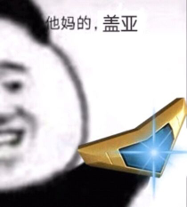

# 风系

### 盖亚
需要觉醒，缓回+挡枪+cut。风系挡枪姬，高难本常客。被雷boss或者大高达暴打的玩家可以考虑交3眼，觉醒完就是你暴打boss。

### 缇坦妮雅，痴女
需要觉醒，单体buff姬，风系拖拉机，和水妙音非常像。曾经的打桩姬，现在仍然可以拿来打塔。打车基本没有上场机会，觉醒优先度低。

### 库丘林，大狗
需要觉醒。倍率不错的自嗨打手，可惜风队强者如云，大狗觉醒也没啥机会进队了。

### 奥丁
需要觉醒，背水挡枪姬，然而风系挡枪的活全被盖亚包揽了。不推荐觉醒。

### 阿萨谢尔，阿萨
需要觉醒。未觉醒状态是自嗨姬，觉醒后是全队一起嗨的~~假卡~~，风队优质buff姬，但是目前也有点过气了，惨。曾经的风系天王，打车神器之一，强烈推荐觉醒。

### 哈斯塔
需要觉醒。风炮击可选组件+破甲姬，上修后变成了多段炮但是段数太少，哈斯塔的破甲是20A破+10属破组合型，能和她配合的破甲姬不多。觉醒优先度中等，缺破甲可以优先考虑。

### QB
被必连击被动坑惨的神姬，你游最惨ssr白值面板。拥有20b破，但是除了破甲毫无用处，风队吉祥物。

### 赛特，华哥
平平无奇的风奶，常年仓管。

### 波塞冬，风菠菜
泳装限定。性能微妙，偏生存+加速，然而热狂buff与恶魔套首饰冲突。基本仓管，CG+2。

### 阿丽安萝德，7姐，风7
需要觉醒，风炮击核心，公会战核心。B特效30秒麻痹，工具人必备神姬。也可以选择强力炮击，非常灵活。炮击是15段输出，配合技伤plus可以打出爆炸伤害（一炮450w）。

### 埃忒尔，龙蛋，风蛋
未觉醒状态可用，~~觉醒提升有限~~，其实觉醒很强。风burst优质组件，20群充+急所，b后追伤（伪300哥）。龙蛋打气是一下15，速度很快可以当车头或者副车头，属于风b队万金油角色。自带的わくわく表情十分魔性。

### 奈芙蒂斯，风萝
圣诞限定。20属破+自嗨姬，上修了还是基本仓管，CG+2。

### 伊西斯
旺盛+挡枪姬，然而风挡枪的活全被盖亚包揽了，平时仓管。本体武器神盾炮是可堪一用的大旺盛。

### 艾尔，不沉舰
按照血量上限百分比回复的姬，堆高血量和回性就是打不死的小强。B后刷新奶，挨打回气→B→奶→挨打回气如此循环，曾经的迷宫最终层杀手，然而除了能挨打没别的用处了。

### 密涅瓦
烧血型buff姬，buff效果量不错而且可以让自己光速去世，塔和桩有出场机会。~~本体武器翠风灯是目前风系最好的技伤武，~~已经不是了，但是翠风灯能月卡超得也算优势吧。

### 乌列尔，风乌
浴衣限定。生存向风姬，可以提供大量防御buff+一口超级单体奶，吃豆cd很短但是命中率感人，CG很顶。

### 弗丽嘉，女仆，伞女仆
不错的20属破奶妈，技能组很实用，觉醒预定未来可期。

### 索尔，风索
圣诞限定，风burst可选组件之一。功能全面的风奶，招牌技20气的群充+奶二合一。曾经榨干了不少风风人的钱包，万恶之源。

### 阿图姆，阿童木，atm
刷新球+400哥，假卡，风系天王之一。队友越强她越强，只要你游还在出新姬，atm就有无限成长的空间。招牌技单体CD-3~~，各种风队套路的核心~~，打桩打塔必带姬，打车出场率也不低。缺点是对红自动非常不友好，以及某些打桩套路要反复凹被动（秃头）。最近有点过气，不是atm刷不动而是新风姬队友太菜了带不动。

### 伊什塔尔，风凛，超级兵
炮击+30A破，风队第一个30破甲姬，然而持续时间只有120秒，本身是炮击定位但是上限感人，被称作超级兵不是没有原因的。

### 马内斯，风女仆（第二个女仆），食尸鬼
泳装限定，高难对策姬。需要送两个队友才能完全启动，所以称作食尸鬼。启动后的buff非常强力，配合别的风盾奶姬甚至可以全程无伤干掉大高达。高难本手操专用，平时打车基本没法出场，或是放在替补位收拾残局。

### 关羽，二爷
日服联动限定（繁中服没有）。20C破+400哥车头，风burst队组件，~~风系天王之一，~~但是风B死了，寄！最近有过气的趋势（不需要破甲的场合，可被7姐代替）。目前尚未复刻。

### 瓦胡，风瓦胡，风箭龟（水瓦胡叫水箭龟）
30B破，风平A组件之一，可惜风平A体系还未成型，未来可期。风系第二好用的破甲姬，然而持续时间只有150秒（还是不够长）。

### 塞勒涅，风假面，风怪盗
大高达对策姬，自身输出还算不错。大高达以外的车基本看不到她出场。

### 欧西里斯，风\*\*，风ass
泳装限定。风burst组件，反逆风核心，拥有高效果量的反逆buff+30气群充，自身半血以下也是个400哥。缺点是风欧西里斯只管全队烧血，没有提供有效的生存手段，风反逆玩法属于是棺材板里仰卧起坐，一不小心就会翻车。

### 风妙音
风系输出大爹，自带30高命中率破甲，风炮击可选组件，风反逆优质组件。5/6覆盖的30属破命中率极高（基本可以看做是必中），残血状态每回合百万级别的自动炮，b后再追加百万级别的炮击（约等于300哥+100w自动炮），打车打桩打塔打公会战都有良好体验。

### 波雷亚斯，爽，风爽
新年限定，强力buff+强力炮击+400哥，短期战特化姬，风炮击可选组件之一，风核爆可选打手。爆发力十足但是不持久，好在本身定位明确，要么开局打一波然后送掉，要么放替补后期上场爆发一波。

### 风药师
你游第一个后备大药。本身作为风奶奶量非常不错，但是burst没有伤害，这就很难受了。高难本表现也不错，更多的情况是放在替补蹭一瓶大药。现在大药姬多了，药师的价值也大幅下降。

### 修普诺斯，妈，风妈
杂技姬，全队挂机一回合，下一回合爆炸输出，风核爆套路核心（尚未开发），已经有开发了，甚至可以给别的核爆队打工。本体是风系最强平A武器（妈剑）。

### 普鲁弗拉斯，风女仆（风系第三个女仆了）
炮击+挡枪姬，然而风挡枪的活全被盖亚包揽了。但是这个姬可以挡aoe，在某些场合优于盖亚。

### 风美神
婚纱限定。风平A组件，拥有平A乘区buff，附带自动炮的万金油风净化奶。CG有牛，纯爱慎点。

### 赫尔墨斯，魔术师，风眼镜
炮击+buff姬。曾经的风炮击最后一块拼图，然而光速过气。自身的buff效果和炮击伤害都不错，但是及其不稳定，实用性很低。本体是风系的大会心武器（惊奇杖）。

### 伊塔库亚
浴衣限定，风炮击核心，~~风炮击最后一块拼图~~，然后也有点过气了。20B破+自动炮+招牌buff，技伤plus（可以使全队每一段炮击伤害提升15w），这个提升有多恐怖？曾经的风7是15w\*15次炮击伤害，现在直接翻倍30w\*15次。同理对atm和哈斯塔的多段炮击也是有着显著提升。

### 风阿蒙，万圣限定
风队长期战特化速b组件，长期战表现优秀，定位和龙蛋非常相似（充气，急所，b后追伤），比龙蛋多个异常盾，长途车的表现优于觉醒龙蛋。核心是被动的乌鸦buff，用一次幻兽叠一层（最多5层），叠满可以提供40%的属刃，且群体充气由20变为30，追伤也差不多有B200W追150W的水平。目前主要用于雷140对策。

### 风king，风金谷
背水型注目挡枪姬。靠注目挡枪，懂的都懂。和风妙音一样有个一键背水，但是忍耐的效果量不如妙音，覆盖率也不如妙音，炮击也不如妙音。在目前的风队里几乎没有出场机会（雷140单点附带15000真实伤害，带风king就是去送人头的）。本体是你游第一把提供特殊攻击乘区的武器，也是目前唯一一把，效果是对攻击/技巧型（红色和紫色）神姬提供30%的固定特殊攻击加成，可叠加。

### 埃力格，圣诞限定
风队buff兼炮击姬。最初是设计成魔宝石活动对策（远井是这么介绍的），实际上刷活动关确实好用。亮点是3/6的30属刃+二连三连（二连比阿萨高，三连比阿萨低）+队友使用红技能附带50w基础的追击炮。Buff量非常不错，可惜覆盖率低于阿萨。追击炮的覆盖率也很感人，风7姐和风妙音的自动炮无法触发追击炮，而且风队目前没有频繁使用红技能的角色（只有风箭龟），实际的炮击效果不算理想，是未来可期的角色（就看远井愿不愿意）。最近一期炮击桩有上场，其实还行。

### 小狐狸，神妖联动限定
风队最好用的打车奶妈（有水宝那味了）。一技能25%\*2的减伤。二技能15%\*2的攻防buff+20%\*2的旺盛+2000\*2的防壁，目前你游最高效果量的群体旺盛（之前是35%那一档）。技能组攻守兼备，简单粗暴，突出一个安逸。然而已经有觉醒弗丽嘉或者风美神的场合，小狐狸的抽取优先级并不算高（毕竟不是人权姬，没有一样能玩）。然后凭借30%攻刃40%的最高旺盛buff变成了菠萝队第一buff工具人。

### 风卡利，塔利班
风反逆打手。机制和暗系原皮相似，靠主动压血获得倍率，靠2技能获得生存能力，区别是原皮的三技能可以一键满气（可以当做充气工具人送掉），而换皮的三技能获得了非常不错的续航能力。再加上一技能反逆buff和被动半血以下增加特攻，风卡利可以作为合格的风反逆平A系打手。然而目前风反逆队仍然缺乏核心组件，整个反逆体系并不成熟（缺少类似暗龙蛋定位的角色），风卡利只能说是有实力，但未来可期，但是不可期。

### 卡里忒斯
风旺盛平A组件。一技能裂伤（等效20专属破甲，并降低目标的连击率），和暗巴的刺伤debuff（全伤害plus）对比，实在是意义不明。二技能4/7上限20W的旺袭。三技能和圣诞火QB同款的自身必三连+平A
plus。亮点是覆盖率不错的旺袭buff以及被动（触发三连的角色回合结束回复400），在一定程度上可以作为伞女仆的上位替代（奶量不如女仆但是多个旺袭buff）。B后特效是追加当前血量\*50倍的固定真实伤害，上限150W，超出部分衰减，也就是自身血量3W就能够到追伤上限。本体武器是风盘首个大急所。（好消息
风队有大急所了
坏消息
暗队4年前就有一样模板的了，而且现在还白送）

### 风撒旦，泳装限定
风平A核心。一技能35W极旺袭（满血时）+每击100吸血，二技能标准4/7覆盖的20%平A单体破甲，三技能每6t一次的即座，自身有10buff以上变为双即座（目前有bug，只需要7buff就能双即座，可能与首饰有关）。被动必三连，但是每一击回气只有1.7，这回气效率基本可以告别b特效了，不想B可以不B，但是输出是真的高。

评价
众所周知平A破甲是平A队的入场券，风撒旦的出现意味着风平A从"垫底"变成了"能玩"。值得一提的是风撒旦的输出非常离谱，是目前所有平A破甲姬里输出最高的，不过目前风平A的组件不齐，除了撒旦风队没有能拿得出手的姬，所以对于风平A队，我只能送上四个字《未来可期》。

### 贾巴沃克，毒龙
风炮击组件。被动
使用技能时从，，，，中随机抽取一个buff。B特效为抽取2次buff。各buff最多持续5T，重复抽到刷新持续时间。

红心
自身连击率up

黑桃
自身特殊攻击+20%

梅花
自身回性+10%，缓回300

方块
自身15cut

自身平A乘区+30%，平A上限+30%。技伤乘区+100%，技伤上限+50%。B乘区+100%，B上限+50%

一技能
全队1T特大技伤buff（50乘区50上限），持有或时全队奶1000。

二技能
6T CD的30W驱散炮，持有或时驱散变成两次。

三技能
3T
CD的10W\*7炮击，持有时伤害变成15W\*7

评价
风炮击版彩虹剑，技能组花里胡哨，然而CD过长以及标伤过低。自身的输出能力非常依赖抽到小丑buff，然而没有稳定的小丑buff入手方式，鉴定为寄。

### 权天使
风炮击核心输出。自身拥有独特的token机制
结晶。结晶上限为10个，一技能与B特效会生成3结晶。被动每回合结束时根据身上的buff数量生成结晶，1\~3buff生成1结晶，4\~7buff生成2结晶，8buff以上生成3结晶。且回合结束时自身拥有10buff以上会自动使用一技能（注
生成的结晶也算在buff层数里，有几个结晶就算几层，不愧是铁库罗斯的程序员）。

一技能
7T CD 40W炮击并生成3个结晶。

二技能
2T CD
消耗所有结晶造成（1+消耗数）\*15W的多段炮击伤害，核心输出技能。

三技能
3/6覆盖的自身炮击性能up（目测在20\~40%之间）并附带自身10W
炮击plus。若累计使用结晶超过10个则进一步强化（炮击性能强化，炮击plus变为15W）。

继风7姐之后，风炮击队第二位真正意义上的多段炮主力输出手，且自身机制足够优秀不需要依赖辅助（这点强于7姐，7姐基本绑定atm辅助），但是自身机制不吃刷新也是一大劣势。使用时需要注意快速凑齐自身10层buff来达到最快启动速度，也就是说基本绑定了爱迪生队。

优点
自带炮击buff与可观的多段炮+自动炮，输出稳定。

缺点
输出过于稳定，不受减CD（刷新球）的收益，依赖buff的堆叠（绑定爱迪生）。

以及换了画师，CG表现糟糕，差评（被圣诞SR那身薄纱）。

### 拜亚提斯，万圣限定

一技能30减攻减防+异常耐性down

二技能3/7覆盖恐伤，B后CD-2

三技能3/6覆盖追袭5W，防壁2500，属刃20

简评
目前风系最好用的破甲手，自带不错覆盖率的恐伤，还带有风队稀有的属刃buff。需要注意的是恐伤上限为2%\*15个debuff的易伤效果，新风姬自带8个debuff，剩下7个debuff比较难凑。
